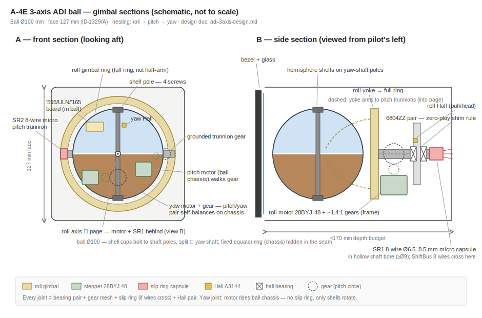
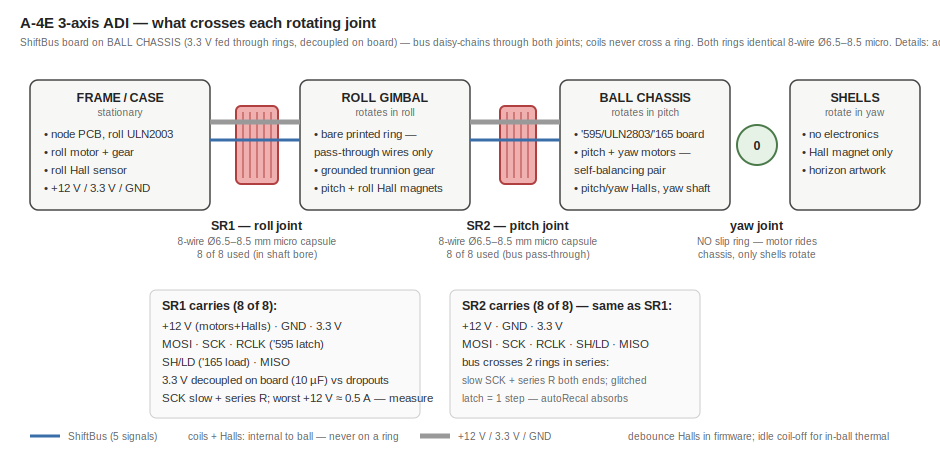

# 3-Axis ADI (AJB-3A ball) — design notes

Physical, motor-driven replica of the A-4E-C main ADI: true 3-axis all-attitude
ball (roll / pitch / yaw-azimuth), same mechanism family as the F-4 attitude
indicator reverse-engineered by Ken Shirriff
(<https://www.righto.com/2024/09/f4-attitude-indicator.html>).

Technique notes (common practice across hobby printed-instrument builds):

- **Micro capsule slip ring in the hollow shaft bore** — ring on the axis
  centerline, wires exit through the bore; no twisting harness.
- **Zero shaft play rule** — shim the bearing seat (tape works) until the
  shaft has no perceptible play; one generous, tightly-seated bearing beats
  two sloppy ones.
- Hall magnets (5×5×5 neodym, actual ~4.5 mm) glued in printed pockets,
  **south pole facing the A3144**; sensor glued into a printed sinking.
- Brass rod rails (Ø4–6) between the bezel stack and rear body as the case
  chassis; M2.5/M3 heat inserts throughout.
- Motors offset from the axes via printed gear pairs.
- Bezel markings: engraved black material with paint-fill, or laser-engraved
  acrylic; 3 mm warm-white LEDs ring the dial for lighting.

### A-4E target dimensions

Derived from real-unit data (ID-1329/A / ARU-11/A family + Apollo-FDAI
proportions) and hardware fit. Hardware (motors, bearings, capsules) is
chosen by fit, never scaled.

| Element | **A-4 target** | Basis |
|---|---|---|
| Face W × H | **127 × 133.4** | real unit 5.00 × 5.25"; extra height = flag/legend zone |
| Ball | **Ø100** | family ball:face ratio ≈ 0.8 (FDAI spec min 3.75", replica estimates ~4.25") |
| Viewing aperture | **Ø90** | ball − 2 × 5 mm swing clearance |
| Glass (clear acrylic) | **Ø96** | aperture + seat margin; laser-cut disc |
| Ball–aperture clearance | **~5 /side** | swing clearance for caps |
| Shell caps | **2 × ~47 deep symmetric + 4–6 gap** | split ⊥ yaw shaft, fixed equator ring in the gap |
| Case depth behind bezel | **~170** | stack-up below; real 247 was servo-amp electronics we don't have |
| Roll shaft | **Ø16–20 hollow, bore ≥ Ø9** | SR1 micro capsule lives in the bore |
| Roll bearing | **6804ZZ 20 × 32 × 7** (pair) | rides the Ø20 hollow shaft |
| Drive gears | **~Ø32 gear / ~Ø23 pinion**, module ≈ 1.25–1.5 | ~1.4:1 working assumption pending tooth-count decision (finding #3); FDM-friendly module |
| Chassis rails | **Ø6 × ~200** | brass rod or 6 mm alu standoffs |
| Shell wall | **2.5–3** | print stiffness vs cap mass (balance) |
| Motors / Halls | 28BYJ-48 12 V, A3144 | fixed hardware |

Depth sanity: ball 100 + yoke 15 + shaft/gear 45 + bulkhead 15 + capsule
tail ≈ 165 → fits the 170 budget with the bezel stack.

## Decisions locked

| Topic | Decision |
|---|---|
| Motors | 28BYJ-48 **12 V** variant, ULN2003 driver, one per axis |
| Step mode | **Full-step** (2-coil-on): 2037.9 steps/rev → 0.177°/step, plenty for 1–2° display accuracy |
| Position | Open loop + **Hall homing every boot** (A3144 + magnet per axis); gearbox ratio is 63.684:1 (non-integer) so cumulative position never survives a power cycle |
| Deadband | Software deadband (~3 steps ≈ 0.5°) so DCS jitter doesn't buzz the motors |
| Step rate | Start 400 full-steps/s (~70°/s ball). Reported hobby bench data for the 5 V variant: stable ≤ ~410 steps/s, stalls ≥ ~444 steps/s. 12 V variant expected higher — bench-tune. Fast rolls lag + catch up via shortest path; cosmetic |
| Steps/rev constant | Use true 2037.886 (63.684:1 × 32), not nominal 2048 — 0.5 % ≈ 1.8°/rev drift on continuous axes otherwise. Opportunistic re-zero on Hall pass = optional drift kill for long sessions |
| Gimbal nesting | Roll = outermost (motor on frame) → Pitch = middle → Yaw = innermost vertical shaft (motor rides the internal mechanism; only the two hemisphere shells rotate) |
| Motor placement | **Faithful to the real unit (re-baselined 2026-07-14): pitch + yaw motors both on the ball chassis**, flanking the yaw shaft as a **self-balancing pair** (each cancels the other's static moment — near-zero counterweight). Pitch motor's pinion walks a gear **grounded to the gimbal trunnion**. Gimbal = bare printed ring, no motor, no counterweight, no electronics. Fallback if ball packaging fails its CAD gate: pitch motor on gimbal (adds ~70 g at ring radius) |
| Joint wiring | **ShiftBus micro-board ('595→ULN2803 8 ch + '165, no regulator) on the ball chassis.** Bus daisy-chains through both rings; **SR1 and SR2 carry the identical 8-of-8 set** (+12 V, GND, 3.3 V, MOSI, MISO, SCK, LOAD, LATCH) — coil wires never cross any ring. 3.3 V comes from the node rail (single logic domain; supply-through-ring needs 10 µF + 100 nF decoupling on the board to ride µs ring dropouts — mandatory). No 5 V rail (HC@5 V has V_IH 3.15 V, marginal from 3.3 V STM32); Halls powered from +12 V (A3144 4.5–24 V, OC out → 3.3 V). Both rings = **8-wire Ø6.5–8.5 mm micro capsules** (~$5, 1 A/ring — worst load ≈ 0.24 A across the doubled +12 V pair). The ADI node runs ShiftBus anyway (slip/turn/OFF/lighting I/O) — this is one more segment. PinRef backend → zero firmware change |
| Axis drive | 3 independent axes straight from DCS-BIOS args — no Euler chaining. **Not singularity-free:** see *Singularity behavior* below |

## DCS-BIOS addresses (already in repo ledger — do not re-derive)

`docs/_source/controllers/a4e-c-dcsbios-addresses.md`, `Firmware/Libraries/A4EC/A4EC_OutputIds.h`.
All 16-bit, mask 0xFFFF, 0..65535 normalized.

| ID | Addr | Use |
|---|---|---|
| `ADI_PITCH` | 0x844A | ball pitch |
| `ADI_ROLL` | 0x844C | ball roll |
| `ADI_HDG` | 0x844E | ball yaw/azimuth |
| `ADI_OFF` | 0x8450 | OFF flag |
| `ADI_SLIP` | 0x8452 | inclinometer ball |
| `ADI_TURN` | 0x8454 | rate-of-turn pointer |
| `BDHI_ILS_GS` | 0x846C | ADI ILS glideslope bar (arg 381 — module files it under "BDHI") |
| `BDHI_ILS_LOC` | 0x846E | ADI ILS localizer bar (arg 382 — same naming quirk) |
| `ATTGYRO_STBY_PITCH` | 0x841A | standby ADI pitch (separate 2-axis panel) |
| `ATTGYRO_STBY_ROLL` | 0x841C | standby ADI roll |

Float ranges (from `A-4E-C.lua`): ball axes + slip/turn are `{-1, 1}` →
**32768 = exact center/level**, endpoints empirical; `ADI_OFF` is `{0, 1}`.

### Singularity behavior (pitch ±90°)

The mechanism never *locks* — each motor drives its own gimbal at any
attitude. But at pitch ±90° the roll and yaw axes align, so this is a
classic Euler **rate singularity**: displaying a smooth flight path through
vertical requires fast, large roll/heading swings. DCS's own `ADI_ROLL`/
`ADI_HDG` outputs (Euler animation args) swing exactly that way through a
loop — the real AJB-3A ball did too, its servos slewing hard through
vertical.

Consequence at our ~50–70°/s axis slew: **transient display lag near
vertical, self-recovering via shortest-path** once pitch leaves the
singular zone. No hardware jam, no lost zero (Hall autoRecal). Accepted as
a display artifact, same class as fast-roll lag.

**Validation gate (bench, before gimbal CAD freeze):** capture an `ADI_*`
trace (SkyHawkClient or DiagSerial log) while flying a loop + an
Immelmann through vertical; record worst-case commanded °/s per axis and
confirm the lag-then-catch-up behavior is acceptable on the roll rig.
If DCS produces step discontinuities (±180° flips) at vertical rather than
fast sweeps, revisit: wrap shortest-path already absorbs single flips, but
oscillating flips would buzz the motors — a rate limiter in the sketch
would then be the fix.

Float→step scale per axis is **empirical** — calibrate on the planned
bench-rig scenario (a `Firmware/Tests/NeedleGauge` env, to be created when
hardware work starts), record the mapping here per axis. Working assumption: 0..65535 = one full ball revolution on the
continuous axes; verify against DCS before trusting.

## Firmware architecture — no new classes needed

Each ball axis is the **existing production stack**: `StepperMotor`
(`StepPattern::FULL_4STATE`, `HomeMode::SENSOR`, `wrap`, `deadband`,
`autoRecal`) composed under a `NeedleGauge` mapping the 16-bit `ADI_*` value
to 0..2038 steps. Three instances = the whole ball; `ADI_SLIP`/`ADI_TURN`
are two more ordinary NeedleGauges. The `autoRecal`-on-Hall-pass feature
absorbs the 2038-vs-2037.886 steps/rev residue on continuous axes.

Wiring note: `FULL_4STATE` pairs non-adjacent coils, so a 28BYJ-48 through
ULN2003 wires the constructor as **IN1, IN3, IN2, IN4** (the classic
Stepper.h order). Motor +12 V on ULN2003 COM; A3144 needs an external 10 kΩ
pull-up.

Production node: coil PinRefs move from GPIO to the '595→ULN2803 ShiftBus
backend per the standing unipolar-stepper decision — zero class changes.

## Reference diagrams

## Slip-ring wire budget

Unipolar 28BYJ-48 = 4 coil lines + 1 common (+12 V). Commons and sensor
supplies are shareable across everything on the far side of a joint.

**Joint 1 — roll (frame → roll gimbal).** ShiftBus only — the micro-board on
the gimbal turns 13 raw motor/sensor wires into a bus:

| Load | Wires |
|---|---|
| +12 V (motors + Halls) | 1 (~0.24 A on a 1 A ring) |
| GND | 1 |
| 3.3 V (logic, from node rail) | 1 |
| MOSI ('595 SER) | 1 |
| SCK (shared '595/'165 clock) | 1 |
| RCLK ('595 output latch) | 1 |
| SH/LD ('165 parallel load) | 1 |
| MISO ('165 QH return) | 1 |
| **Total** | **8 of 8** |

3.3 V crosses the rings (no LDO on the ball board) — **10 µF + 100 nF
decoupling at the logic is mandatory** to ride µs ring micro-dropouts.

→ **8-wire Ø6.5–8.5 mm micro capsule** (bore ≥ Ø9) in the hollow roll-shaft bore —
ring-in-shaft mounting (the WX micro-cap family spans 4/8/12-wire at these
diameters). Worst +12 V current: both motors
slewing, 2 coils each ≈ **0.5 A** (finding #4: measure simultaneous worst
case on the rig) — split across the doubled ring pair; micro-ring rating
~1 A/ring.

**Fallback if 8-wire unavailable small:** 12-way 12.5 mm capsule (longer
body, bore ≥ Ø13). **6-wire ring option:** merge RCLK+SH/LD into one
shared strobe (idle-high, double low-pulse per frame; first rising edge
re-latches the '595 with data it already holds — harmless). Needs a small
ShiftBus shared-strobe option + spec sync; keep only if sourcing forces it.

Bus-through-ring caution: cheap capsules micro-dropout — keep SCK slow
(~100 kHz), series R both ends; a glitched RCLK = one wrong coil pattern
for one step, absorbed by autoRecal.

**Joint 2 — pitch (roll gimbal → ball interior).** Identical to joint 1 —
the bus passes straight through (gimbal carries only pass-through wires):

| Load | Wires |
|---|---|
| +12 V | 1 |
| GND | 1 |
| 3.3 V | 1 |
| MOSI / MISO / SCK / LOAD / LATCH | 5 |
| **Total** | **8 of 8** |

→ second **8-wire Ø6.5–8.5 mm micro capsule** in the hollow pitch trunnion
(~12 mm body fits a short trunnion). Buy **3 identical rings** (SR1 + SR2 +
spare). Bus crosses two rings in series — double the dropout exposure on
SCK/LATCH; keep the clock slow, series-R both ends (autoRecal absorbs any
glitched step).

**Joint 3 — yaw: no slip ring.** Motor and sensor ride the ball chassis;
only the hemisphere shells rotate.

**Thermal note (board-in-ball):** ~3 W of coil holding dissipation inside a
closed sphere if coils stay energised at rest. The 28BYJ gearbox barely
backdrives, so the plan is an **idle coil-off timeout** (de-energise after
N s at target; gearbox friction holds attitude) — small StepperMotor
addition, or bench-measure temperature first and skip if a non-issue.

### Homing sensor / magnet placement (no Hall wire crosses any ring)

Sensors live where the wires are (frame, or ball chassis with the '165);
magnets go on the other side of each joint. South pole faces the A3144.

| Axis | Magnet | Sensor (wired side) | Ring cost |
|---|---|---|---|
| Roll | gimbal yoke | **case/frame** → node directly | 0 |
| Pitch | gimbal arm | **ball chassis** (equator ring) → in-ball '165 | 0 |
| Yaw | inside shell cap | **ball chassis** → in-ball '165 | 0 |

### Interconnect alternatives considered (record)

| Option | SR1 wires | Verdict |
|---|---|---|
| Raw coil wires, no board (v1) | 13 | rejected — 18-way 22 mm capsule forced Ø30 shaft + 6806 bearings (review finding #2) |
| ShiftBus board on gimbal + local LDO (v2) | 7 | superseded — put board + pitch motor mass on the gimbal ring (~70 g + counterweight at radius); SR2 carried raw coils |
| **ShiftBus board on ball chassis (v3, faithful)** | **7 (both rings identical)** | **adopted** — motors self-balance flanking the yaw shaft, gimbal stays bare, coils never cross a ring; zero firmware change, SPI glitch-tolerant |
| I2C MCP23017 board on gimbal | 4 | rejected — measured stepper-over-MCP throughput ~490 steps/s @ 400 kHz total; two motors need up to ~800, and ring derating (~100 kHz) makes it ~4× worse; glitch = bus hang |
| Step/dir (2× A3967 EasyDriver on gimbal) | 9 | rejected — more wires, needs bipolar motor conversion + new MotorDriver subclass; glitched STEP = silently lost step |
| Both motors on gimbal (bevel differential through trunnion) | 7, **SR2 = 0** | rejected — pitch↔yaw kinematic coupling needs a coupled-axis output class + concentric-trunnion mechanics + backlash stack |
| Pitch motor on gimbal (v2 layout) | 7 | fallback if ball packaging fails CAD gate |

**Expansion path:** two micro capsules stack in series inside the same
hollow-shaft bore (wire exits both ends) — 16 channels through one joint
for ~$10 if shell lighting / OFF-flag ever need conductors. Cheaper than
any single large or through-bore ring (those run $20–40).

History: the first-pass design passed raw coil wires across joint 1
(13 wires → 18-way 22 mm capsule → Ø30+ hollow shaft + 6806 bearings).
Review finding #2 exposed the joint bulk; the ShiftBus board — already the
production plan ('595→ULN2803 + '165 on ShiftBus, PinRef backend) — shrinks
both joints to identical micro capsules. Adopted 2026-07-14.

### Sourcing candidates

_(researched 2026-07-14 — see table below; per project rule these are
options to review, nothing ordered)_

| # | Vendor / listing | Model | Cond. | A/ring | OD × L | Mount | ~Price |
|---|---|---|---|---|---|---|---|
| 1 | SenRing (Amazon "Arionyx"/Roda) | M220-18 / SNM022A-18 | **18** | 2 A | 22 × 33 mm | flangeless (A-flange option) | $20–35 |
| 2 | AliExpress generic | SRC022A 18-wire | 18 | 2 A | 22 × ~33 mm | stator flange + rotor tab | $8–21 |
| 3 | SenRing / AliExpress | M220-24 | 24 | 2 A | 22 × 40 mm | flangeless | ~$25 |
| 4 | Adafruit #1196 | M220-12 type | 12 | 2 A | 22 × 26 mm | 44 mm ABS flange | $19.95 |
| 5 | Adafruit #1195 | M120 type | 12 | 2 A | **12 × 20 mm** | plain tube | $24.95 |
| 6 | SenRing (Evelta) | M125A-12 | 12 | 1.5 A | 12.5 × 23 mm | flangeless | $25–30 |

Fit (final): **both joints → Guren WX7.9-8PS** (ordered 6× 2026-07-15,
~$12/pc landed via Alibaba; seller: Shenzhen Guren Technology, catalog PDF
in hand). Datasheet:

| Param | Value |
|---|---|
| Body | Ø7.9 × 11.8 mm (13.8 mm incl. Ø2.4 rotor-outlet boss) |
| Circuits | 8-way, 1 A, 0–48 V |
| Leads | AWG30 PTFE; rotor 150 mm, stator 200 mm; colors black/brown/red/orange/yellow/green/blue/purple |
| Rated speed / life | 100 RPM / 500k rev |
| **Rotational torque (spec)** | **0.05 N·m + 0.01 N·m per 6-way ≈ 0.06 N·m** |
| Shell | engineering plastics, IP51, −20…+80 °C |

Mounting: shell is plastic — **slip-fit bore (Ø8.0–8.1) + retention (CA dot
or printed clamp), NOT a heavy press-fit** (shell crush can bind brushes).
Rotor boss Ø2.4 with leads exits the rotating end.

**⚠ Torque-margin flag (feeds finding #3):** spec drag ≈ 0.06 N·m vs
28BYJ-48 running torque ≈ 0.034 N·m — on paper one ring's breakaway drag
exceeds the motor through a 1.4:1 mesh (0.06/1.4 ≈ 0.043 N·m at the
motor). Datasheet drag is a conservative max — hobby builds drive this ring
class with this motor successfully — but this makes the gear
ratio a **torque decision, not just resolution/speed**: bench-measure real
ring drag on the rig, and if it is anywhere near spec, roll/pitch external
ratio moves from 1.4:1 toward **2:1–3:1**. Yaw axis carries no ring — its
ratio can stay low.

12-way fallback if 8 conductors ever run short: WX6.5-12PS (Ø6.5 × 15.6,
1 A) — same bore class. Flanged WX12-8PS (Ø12.4 × 15.4, 2 A) = the fatter
alternative rejected for bore size.

Reliability notes (from vendor/failure-mode research):
- Gold-on-gold contacts, rated 300 rpm — gimbal speeds are negligible; main
  cheap-unit failure mode is µs-scale micro-dropouts under vibration.
  Harmless for coils; **filter/debounce the Hall home signals in firmware**,
  never raw edge-trigger through a ring.
- Contact resistance tens of mΩ, varies with angle — irrelevant at 0.26 A.
  Real current limit is the 26–30 AWG pigtails, not the rings; double-up a
  spare ring on +12 V common for margin.
- Route Hall outputs as pulled-up digital next to a dedicated GND ring; no
  high-impedance analog through cheap rings.
- Flangeless capsules: clamp the gold body on the stator side; the small
  rotor tab must be captured in a slot with zero side-load or brushes bind.
- Body length stacks up inside a nested gimbal: 18-ch = 33 mm plus wire
  exits both ends — model it early in CAD.

## Bearing / gimbal BOM skeleton

Printed gimbal rings, standard metric ball bearings at every axis, motor
offset from each axis via printed gear pair (~1:1 — resolution is already
0.177°/step; extra reduction just slows the display), capsule slip ring ON
the axis centerline (capsule body = stationary side, capsule shaft = rotating
side, so the wire bundle never twists).

| Item | Qty | Spec (prototype) | Notes |
|---|---|---|---|
| Roll shaft | 1 | Ø16–20 hollow, **bore ≥ Ø9** | Ø6.5–8 SR1 micro capsule lives in the bore; leads exit both ends |
| Roll axis bearings | 2 | **6804ZZ 20×32×7** | pair on the hollow shaft, zero-play shim rule |
| Pitch trunnions | 2 | one hollow ~Ø13, **bore ≥ Ø9** | SR2 micro capsule (~12 mm body) in the hollow one; drive gear on the other |
| Pitch trunnion bearings | 2 | **6802ZZ 15×24×5** | one per side of roll gimbal |
| Yaw shaft bearings | 2 | MR85ZZ 5×8×2.5 | vertical shaft inside ball |
| Slip rings | 2 (+1 spare) | **8-wire Ø6.5–8.5 mm micro capsule, 1 A/ring** | Guren WX7.9-8PS; both joints identical |
| ShiftBus micro-board | 1 | '595 + ULN2803 + '165 + 10 µF/100 nF decoupling | rides **ball chassis**; drives pitch+yaw coils, reads both Halls; 3.3 V fed from node via rings |
| 28BYJ-48 12 V | 3 | ULN2003 module for bench only | production coils all from the gimbal ULN2803 + node ShiftBus |
| A3144 Hall + magnet 5×5×5 | 3 | one per axis, **powered from +12 V** | OC out pulled to 3.3 V; south pole faces sensor |
| Gears | 3 pr | printed, herringbone | tooth counts = open decision (finding #3); balances axial gear thrust — does NOT remove bearing endplay/backlash; keep backlash < 1 display degree |

**CAD gate (finding #2):** dimensioned cross-section of BOTH joints —
capsule body + lead exit + bend radius, rotor-tab restraint slot, bearing
seats, hollow-bore IDs — before the first structural print.

Shaft stock: 8 mm + 6 mm + 5 mm silver steel offcuts, or printed shafts with
steel only at bearing seats for the prototype.

## Real-unit proportions (research)

Researched 2026-07-14 (sources: righto.com F-4 + Apollo-FDAI teardowns,
NSN records).

**A-4E unit identified: ID-1329/A** (spec MIL-I-23524, white OFF flags),
used with the AN/AJB-3A on the A-4 — Shirriff's F-4 article footnote 9
names it explicitly; his teardown unit is likely this exact variant.
NSN 6610-00-134-1322.

| Fact | Value | Source |
|---|---|---|
| ID-1329/A case | **5.000" W × 5.250" H × 9.710" D** (127 × 133 × 247 mm) | nsndepot NSN 6610-00-134-1322 |
| F-4 ARU-11/A case (same family) | 5.000 × 5.000 × 8.391", 8.5 lb, 32-pin rear connector | nsnlookup NSN 6610-00-055-8535 |
| Ball diameter | never stated; **inferred 3.75–4.25" (95–108 mm)** from the "almost identical" Apollo FDAI ball (spec min 3.75", replica estimate 4.25") | righto.com/2025/06 + therpf.com (uncertain) |
| Ball : case ratio | ≈ 0.8 | inferred |
| Hemisphere attachment | two shell caps bolt to vertical-shaft poles, **4 screws per pole**, split ⊥ shaft; caps rotate around a fixed equatorial ring on the internal mechanism | righto.com/2025/06 |
| Real slip rings | roll set at base (stationary brushes, rotating striped shaft, wires exit through hollow shaft); pitch set hidden inside ball; **none on azimuth**. FDAI roll stack = **23 rings** | righto.com/2024/09 |
| Real servo loops | 3 identical: synchro in → control transformer → transistor amp → 2-phase AC induction motor + eddy-current tach on one rotor | righto.com/2024/09 |
| Lineage | X-15 (Lear 1959) → ARU-11/A (F-4) → Apollo FDAI → Shuttle ADI | righto.com/2025/06 |

**Replica design targets:** 5" (127 mm) bezel face per real case; ball
**Ø100 mm** (prints in halves, sits in the 0.8 ratio); case depth free —
~150 mm should swallow gimbals + 22 mm slip ring (real 247 mm depth was
amplifier electronics we don't have). 28BYJ-48 body is Ø28 × 19 mm —
one motor inside a Ø100 ball is comfortable, two would be cramped
(supports the pitch-motor-on-gimbal deviation). Cross-check bezel size
against DCS Model Viewer measurement before CAD (panel-mapping skill).

## Mechanism design sequence

Structure recap (matches the real ARU-11/A family): roll shaft through the
rear case on the 6804ZZ pair, full roll gimbal ring, pitch trunnions
(6802ZZ), ball chassis carrying both steppers + board, shell caps on the
yaw-shaft poles around the fixed equator ring.

Design sequence (CAD):
1. **Axis skeleton first** — three datum axes crossing at ball center in
   FreeCAD, envelope sketch: Ø100 ball, 127 mm face, ~170 mm depth budget.
2. **Ball chassis** (innermost, hardest, no dependencies): yaw stepper +
   1.4:1 gear + vertical shaft + shell mounting poles inside Ø96 (leave
   2 mm shell wall clearance). If this doesn't close, nothing else matters
   — do it before any outer part.
3. **Pitch trunnions** outward from chassis: bearing seats, slip ring 2
   bore, driven gear on one trunnion, Hall magnet ring.
4. **Roll gimbal ring** sized around the swung ball envelope (ball + chassis
   swings through it in pitch — check the swept volume, not the static one).
5. **Case + roll drive** last — conventional rear-body + hollow-shaft
   construction, lowest-risk part of the build.
6. Shells: **two caps bolted to the yaw-shaft poles (4 screws each), split
   plane perpendicular to the yaw shaft** (a 2-axis ball could split on any
   meridian — a yawing ball cannot). Between the cap lips sits a **fixed
   equatorial ring** belonging to the ball chassis (on the real unit the
   pitch-trim pot terminals protrude through it); it stays hidden in the
   seam. Horizon artwork spans both caps with a hairline seam at the yaw
   equator — the real instrument has the same seam.

Rule of thumb throughout: every rotating joint = bearing pair + gear mesh +
(maybe) slip ring + Hall pair. Design each joint as that 4-item checklist
and the mechanism can't surprise you.

## Manufacturing feasibility (FDM / resin / laser acrylic)

Whole mechanism is FDM-feasible — hobby printed-ADI builds prove the
technique class at smaller sizes, and our accuracy need (0.177°/step) is
far coarser than print tolerance. Process per part:

| Part | Process | Notes |
|---|---|---|
| Case, rear body, motor mounts | FDM (PETG) | nothing special |
| Roll gimbal ring | FDM, printed flat | strongest in-plane; heat inserts for trunnion bearings |
| Ball chassis | FDM (PETG) | bearing seats print −0.1 mm and ream; shim-to-zero-play rule |
| Equator ring | **laser acrylic (3 mm)** or FDM | flat annulus = ideal laser part; stiff, precise |
| Hemisphere caps ×2 | FDM dome-up + sand/prime/paint; **resin optional** for surface | Ø100 thin shell; layer banding disappears under filler primer; resin only buys skipping the sanding |
| Gears (~module 1–1.5) | FDM 0.4 nozzle, herringbone | resin only if module drops below ~0.8 — don't let it |
| Shafts | steel/brass rod at bearing seats | print only non-bearing spacers; yaw shaft = 5–6 mm steel |
| Bezel stack + "glass" | **laser acrylic**: matte black engraved + paint-filled faces, clear disc for glass | matches the faceplate legend pipeline (laser laminate); print+paint-fill = fallback |
| Rear bulkhead(s) | **laser acrylic 3 mm** + brass rod rails | flat, precise bearing/slip-ring bores |
| Ball artwork | paint + waterslide decal (or engrave-and-fill on resin caps) | flat stickers only work near the equator on a sphere |

Resin verdict: **not required anywhere**; optional for cap surface finish.
Resin is wrong for every structural part (brittle at screw bosses, creeps
under bearing preload).

**Balance beats strength.** Real instrument logic: steppers only need to
overcome friction if each stage's CG sits ON its rotation axis. Yaw motor
inside the ball is off-axis mass — counterweight the chassis opposite it;
trim-balance each stage with small screws before closing (spin test: any
attitude should hold when de-energized). An unbalanced ball is the main
functional risk of the whole build — a balanced one lets 28BYJ-48 torque
(~30 mN·m through 1.4:1) loaf.

## Build order (recommendation)

1. **Roll bench rig first** (planned: a `Firmware/Tests/NeedleGauge`
   scenario in the drift_sim style): one motor + ULN2003 + Hall on a
   bracket, driven through the real `NeedleGauge`+`StepperMotor` path with
   synthetic `ADI_ROLL` values. Retires: float→step calibration, homing
   repeatability, deadband tuning, 12 V motor speed check, wrap
   shortest-path, ring drag measurement. Days of work, no mechanical risk
   taken.
2. **Straight to the 3-axis ball.** Skip the 2-axis standby ADI as a
   toolchain gate — it shares only the parts the roll rig already proves
   (motor, homing, DCS-BIOS mapping) and none of the actual risk (nested
   gimbals, two slip rings, hemisphere shells, proportions). Build the
   standby later as its own quick panel (standard two-motor 2-axis layout,
   no slip ring if the horizon-card layout allows; addresses already in
   the ledger).
3. Production integration after mechanics work: PanelGroup STM32 node,
   ULN2803 + '595 on ShiftBus (decision already made for 28BYJ-48 unipolar
   drive), `ADI_*` outputs over CAN — the bench scenario will exercise the
   production classes; only the coil PinRef backend and the calibrated
   constants move afterwards.

## Auxiliary movements (case-mounted, rear — no slip-ring impact)

| Movement | ID / Addr | Actuator |
|---|---|---|
| OFF flag | `ADI_OFF` 0x8450 | **9g servo** (rear, replicating the real solenoid-pulled center rod) + light return spring — detached servo + spring fails to "OFF showing", same semantics as the original |
| ILS GS bar | `BDHI_ILS_GS` 0x846C | 9g servo (2g micro = fallback if space forces it; bench 2g jitter first) |
| ILS LOC bar | `BDHI_ILS_LOC` 0x846E | 9g servo |
| Turn needle | `ADI_TURN` 0x8454 | 9g servo or spare 28BYJ |
| Slip ball | `ADI_SLIP` 0x8452 | **candidate: none** — a real curved-tube fluid ball reads "level", correct for a non-accelerating cockpit; tilt-servo only if DCS-commanded slip is wanted |

Servo power: **own fused 5 V branch** (never the logic rail) — SG90 ≈
10 mA idle / 150–250 mA moving / 650–900 mA stall. Budget 1 A continuous,
~2.5 A peak, PTC 1.5–2 A, 470–1000 µF bulk at the header. Firmware staggers
servo attach/home (joins the sequential axis-homing queue) and **detaches
PWM at target** (kills buzz + idle draw). Firmware backend: `ServoMotor`
(MotorDriver subclass, issue #132) — NeedleGauge then drives all of these
through the existing decode/calibration path.

Remaining open item: backlight.

## Variant strategy (design constraint from day one)

The mechanism is the ARU-11/A family ball — the **F-4E's instrument**
(Heatblur F-4E = far larger pit-building market than the A-4). Keep the
design split so the F-4 SKU is an artwork job, not a redesign:

- **Variant-neutral core**: gimbals, ball chassis, shells, slip rings,
  motors, ShiftBus board, homing — no aircraft identity anywhere.
- **Variant layer**: bezel/faceplate, ball artwork, flag set (A-4 ID-1329/A
  = white flags), knob, case depth trim.
- **Firmware**: identical classes; per-SKU address table only (Heatblur
  F-4E has its own DCS-BIOS module). A4EC generated-IDs pattern ports 1:1.

**Reference provenance:** every mechanical fact in this doc traces to the
F-4 (ARU-11/A teardown) or the Apollo FDAI — A-4-specific data so far is
NSN paper dims + "white flags" only. The variant-neutral core is
therefore what the references actually support; the **A-4 variant layer
must come from DCS A-4E-C ModelViewer** (faceplate proportions, ball art,
flag geometry, knob) — that ticket sub-task defines the A-4 skin, not just
a size check.

F-4E SKU itself: directional — tracked in Notion, not actionable until the
A-4 unit works.
