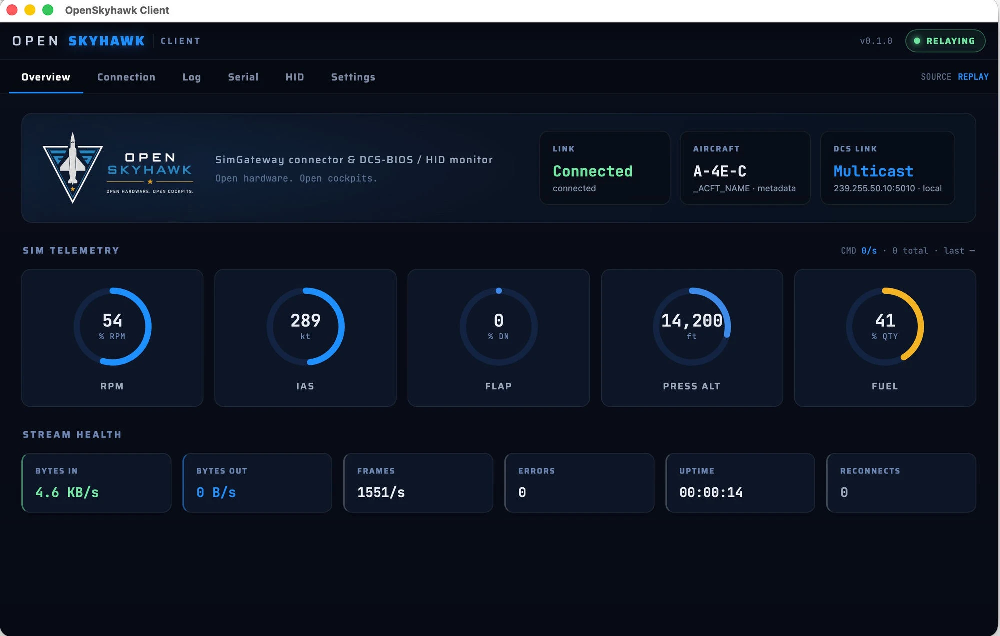
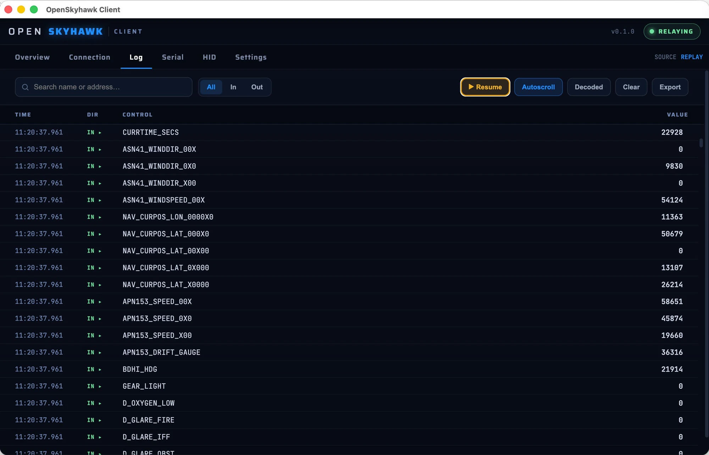
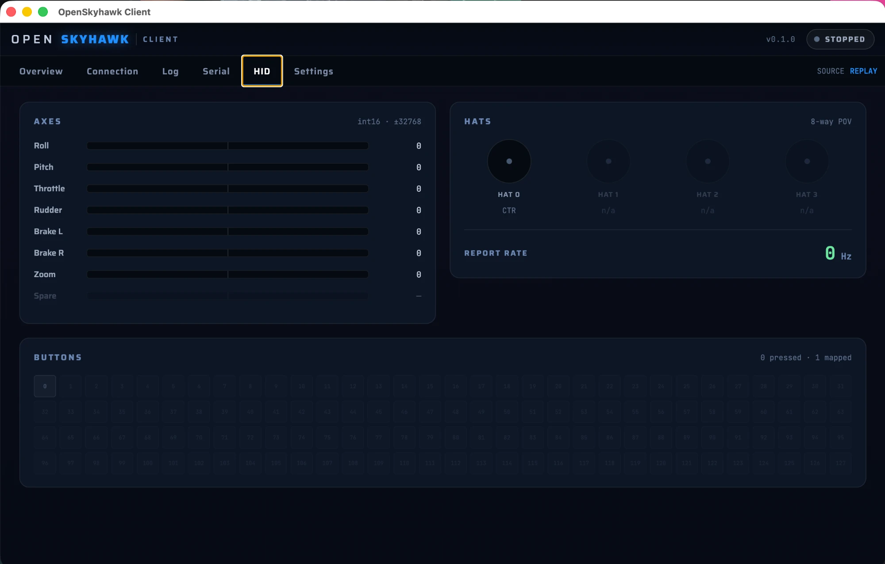
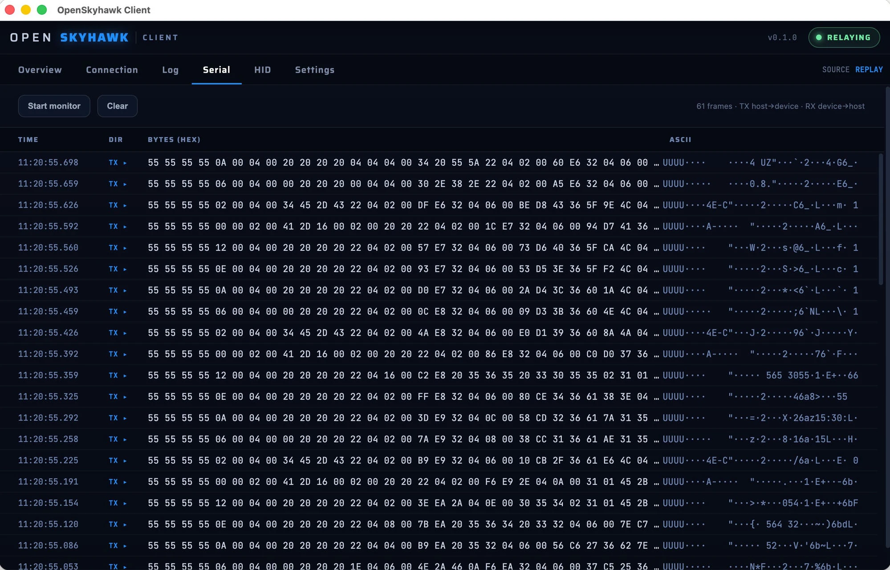

# OpenSkyhawk Client

**OpenSkyhawk Client** is the recommended way to connect your cockpit to DCS. It is a
cross-platform GUI that is both the bridge and the monitor — auto-detecting the SimGateway,
relaying the DCS-BIOS stream both ways, and surfacing live connection, aircraft, and
telemetry status.

The alternative is the legacy `connect-serial-port.cmd` / `socat` relay shipped with
DCS-BIOS. That script still works but is Windows-only, has no UI, and requires selecting the
COM port manually. The client replaces it on both Windows and macOS.

Download from [GitHub Releases](https://github.com/OpenSkyHawk/SkyHawkClient/releases).
Windows (`.exe` installer) and macOS (`.dmg`) builds are provided.

!!! note "Windows SmartScreen"
    The installer is currently unsigned. Click **More info → Run anyway** when Windows
    SmartScreen prompts. This is expected for an open-source project without a code-signing
    certificate.

## Source modes

The client runs in one of three modes, selected on the Connection tab:

| Mode | What it does | Use when |
|------|-------------|----------|
| **Bridge** | Relays DCS-BIOS between the sim and the SimGateway serial port. Also reads the HID joystick interface. | Flying with the cockpit connected. |
| **Monitor** | Reads the DCS-BIOS stream off the LAN with no device attached. Relay and HID are inactive. | Inspecting the stream from a second machine, or testing without hardware. |
| **Replay** | Feeds a recorded capture file into the parser and UI with no DCS running. Optionally writes the replay to a connected SimGateway. | Bench-testing panels, debugging without the sim. |

## Getting started

1. Launch the app and go to the **Connection** tab.
2. Select **Bridge**, **Monitor**, or **Replay** mode.
3. In **Bridge** or **Monitor** mode, set the DCS host and transport:
    - *Loopback multicast* — DCS on the same machine as the client (default).
    - *TCP to host* — DCS on a separate PC; enter `<DCS-PC-IP>:7778`. No script needed on
      the DCS host — just open Windows Firewall for inbound TCP 7778.
    - *Unicast listen* — if you've edited `BIOSConfig.lua` to send a unicast export.
4. Press **Start relay** (Bridge/Monitor) or **Start** (Replay).

## Tabs

### Connection

Where you choose how to connect and watch the link come up. The **device card** shows the
auto-detected SimGateway — identity (*A-4E Skyhawk*), USB **VID/PID `0x2E8A / 0x4134`**, the
serial port (`scanning…` until the device is found), the **CDC serial + HID** interfaces, and
a **Relaying / Stopped** indicator. An **Auto-reconnect** toggle re-opens the port
automatically if the cockpit is unplugged and replugged.

The **Source Mode**, **DCS Link** (host + transport), and **Record** controls live on this
tab too — covered under [Getting started](#getting-started) and
[Recording and replay](#recording-and-replay).

A **Connected nodes** card lists the PanelGroup controllers reported over the CAN bus — node
id, uptime, receive count, and bus-health flags (BOFF / EPVF / TEC / REC). This is **Bridge
mode only** and depends on a firmware node-reporting feature still in progress, so it
currently shows *"No nodes reported"* until that firmware ships.

### Overview

The landing tab — a single glance confirms the cockpit is alive. Three status tiles across
the top show **Link** (idle / connecting / connected), **Aircraft** (the live module name —
from `_ACFT_NAME` metadata, or inferred from the address range when metadata is absent), and
**DCS Link** (the active transport and host).

**Sim Telemetry** below is five live gauges — **RPM, IAS (kt), Flap, Press Alt (ft), Fuel** —
with a command-activity readout alongside (`commands/sec · total · last command sent`). A
gauge reads **—** for any value the sim isn't exporting.

At the bottom, **Stream Health** tracks the relay itself: **Bytes In / Bytes Out** (each
direction), **Frames/s**, parse **Errors**, **Uptime**, and **Reconnects**.

If a non-A-4E module loads, an amber **warning banner** appears — named decode is A-4E-C only,
but **relaying and stats continue** and the log falls back to raw addresses.

### Log

A decoded DCS-BIOS event stream — control name, address, value, and direction — updated live.
Filter by name or address, pause autoscroll, clear the buffer, export to TSV, or toggle raw
hex mode.

### HID

Live status of every axis, button, and hat switch on the SimGateway's HID interface, plus the
**report rate**. Reports are sent on change, so the panel shows an **idle** state ("no recent
report") when nothing is moving. Useful for verifying the SimGateway is outputting the correct
values before binding in DCS.

### Serial

Raw TX/RX hex + ASCII monitor for the CDC serial link (Bridge mode only). Toggle it on to
watch the DCS-BIOS byte stream directly, or to confirm the SimGateway is receiving commands.

### Settings

Developer and diagnostic controls: debug logging toggle (writes `<userData>/debug.log`),
serial port dump (logs all detected ports and their metadata), and a Reveal button to open
the log file. Most users will never need this tab.

## Recording and replay

While relaying in Bridge or Monitor mode, the **Record** card on the Connection tab lets you
capture the live DCS-BIOS stream to a `.json` file. Stop recording to save. The file can
then be loaded in Replay mode on any machine — no DCS or SimGateway required. Useful for
reproducing a specific flight state on the bench or sharing a session for debugging.
