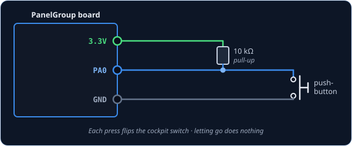
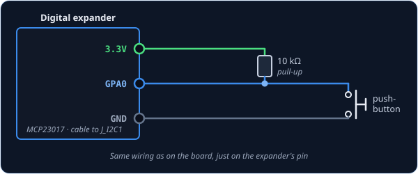
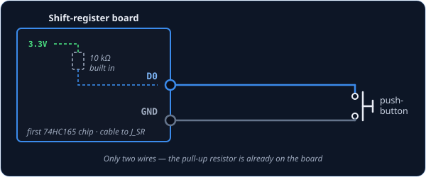

# ActionButton — push-button for a switch that stays put

`ActionButton` is for one situation: the part in your hand is a push-button, but the cockpit
control it stands in for is a switch that stays where you put it. Each press flips the cockpit
switch once, from off to on or from on to off, and letting go does nothing. So the switch stays
put until you press again, just like a push-on, push-off lamp button.

!!! tip "Not quite the right part?"
    - **A toggle switch, or a cockpit push-button?** Use [Switch2Pos](switch2pos.md), which
      copies your part exactly.
    - **Three positions** (ON–OFF–ON)? Use [Switch3Pos](switch3pos.md).
    - **A switch with a flip-up guard?** Use [SwitchWithCover2Pos](switchwithcover2pos.md).

!!! warning "Only for switches that stay put"
    Use `ActionButton` only with a switch whose DCS-BIOS entry offers **TOGGLE**. If the
    cockpit control is a push-button itself, the first press leaves it stuck on until you press
    again. For a cockpit push-button, use [Switch2Pos](switch2pos.md) instead.

## In your sketch

```cpp
const PinRef TAXI_LIGHT_PIN = PinRef(PA0);

OpenSkyhawk::ActionButton taxiLight(DCSIN_LIGHT_EXT_TAXI, TAXI_LIGHT_PIN);
```

These two lines go near the top of your sketch, above `setup()`, and they are all the code a
button needs. From then on the board watches the button for you and tells DCS to flip the switch
every time you press it.

The first line says where the button is wired — here, pin `PA0` on the board. This is called a
[pin address](../pin-addresses.md), and it is the only part that changes if you plug the button
in somewhere else. The second line creates the button itself. `taxiLight` is a name you choose,
and `DCSIN_LIGHT_EXT_TAXI` is the cockpit control it flips, here the taxi light switch.
[DCS-BIOS Integration](../../../firmware/dcsbios-integration.md) explains where to find these
names.

## Wiring

A push-button is wired exactly like a switch:

1. One leg of the button to the **pin**.
2. The other leg to **GND**.
3. A **10 kΩ resistor** from the pin to **3.3V**.

The resistor is called a *pull-up*. While the button isn't pressed, nothing else connects the pin
to anything, so without the resistor it picks up electrical noise. Here that noise would look like
presses, and every one of them flips the cockpit switch. The board doesn't add a resistor for you,
so every button needs its own.

Where the pin itself is depends on what you've plugged the button into. Pick the tab that matches
your build — the wiring and the code look almost identical in each one.

=== "On the board"

    

    You can use any free pin on the board. Each one has its name (`PA0`, `PB1`, and so on)
    printed next to it, and that name is what goes in the pin address.

    ```cpp
    const PinRef TAXI_LIGHT_PIN = PinRef(PA0);
    ```

=== "On a digital expander"

    

    The wiring is exactly the same as on the board, just on one of the expander's pins. Any pin
    works except `GPA7` and `GPB7`, which can't read buttons because of a fault in the chip.

    ```cpp
    const PinRef TAXI_LIGHT_PIN = PinRef(expander1, PORT_A, 0);   // GPA0
    ```

    If this is your first expander, your sketch also needs a couple of lines to set it up.
    [Setting up a digital expander](../expanders.md#digital-expander-mcp23017) walks through
    them.

=== "On a shift register"

    

    Here you only need two wires. Shift-register boards come with the pull-up resistors already
    fitted, so the button just goes between the input and GND.

    ```cpp
    const PinRef TAXI_LIGHT_PIN = PinRef(ShiftBus1, 0, 0);   // first chip, pin 0
    ```

    [Setting up a shift-register chain](../expanders.md#shift-register-chain-74hc165-74hc595)
    explains how the chips are numbered.

## Troubleshooting

**The cockpit control turns on and stays on.**
The cockpit control is a push-button, not a switch that stays put, so it needs
[Switch2Pos](switch2pos.md). Change `ActionButton` to `Switch2Pos` on that line and keep the rest.

**The cockpit switch flips by itself.**
This is almost always a missing pull-up resistor, so the pin is picking up noise and reading it as
presses. Check that there is a 10 kΩ resistor between the button's pin and 3.3V.

**The switch flips when I let go, not when I press.**
Your button is the kind that opens when pressed, or it's wired the other way round. Rather than
replacing it, add `true` at the end of the line and the board will flip it for you:

```cpp
OpenSkyhawk::ActionButton taxiLight(DCSIN_LIGHT_EXT_TAXI, TAXI_LIGHT_PIN, true);
```

??? info "Going further"
    Your button never tells DCS *which way* to set the switch, only "flip it", and the sim works
    out the rest from where the switch is now. That means your panel can never disagree with the
    cockpit, even if the switch was moved with the mouse or the keyboard. The catch is that a
    button can't show you which way the switch is set, so you'll need to glance at the sim.

    Holding the button down counts as one press, however long you hold it. The button has to be
    released before the next press can count.

    Every mechanical button bounces for a few thousandths of a second as its contacts close, and
    here each bounce would be another flip. So the press is sent the instant the contacts first
    touch, and the button is then ignored for **20 ms** while it settles.

    When the board starts up, and whenever DCS asks every control to report in, `ActionButton`
    stays silent. A switch reporting its position again changes nothing, but a button sending
    "flip it" again would flip the cockpit switch each time. A button that happens to be held
    down while the board starts doesn't count as a press either.

    `ActionButton` only talks to DCS-BIOS, so it can't be a joystick button. For that, use
    [Switch2Pos](switch2pos.md) with a joystick button ID.

    Every detail of the class is in the
    [API reference](../../../api/classOpenSkyhawk_1_1ActionButton.md).
