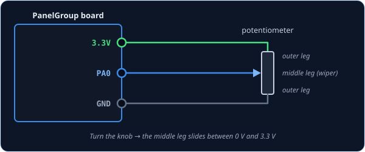
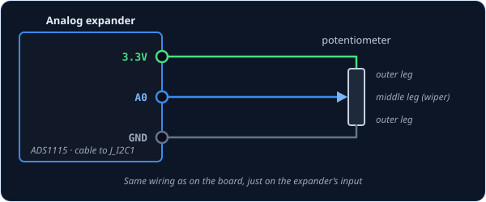

# AnalogInput — knob or slider (potentiometer)

`AnalogInput` is for a **potentiometer**, the part behind most smooth knobs and sliders. Unlike a
switch, it doesn't just say on or off; it says *how far* it's turned. The cockpit control follows
yours smoothly, so when you turn your volume knob halfway up, the sim's volume knob turns halfway
up too.

!!! tip "Not quite the right part?"
    - **A knob that clicks between a few fixed positions?** Use
      [SwitchMultiPos](switchmultipos.md), or [AnalogMultiPos](analogmultipos.md) if it's wired
      as a resistor ladder on a single pin.
    - **A knob that spins round and round without stopping?** That's a rotary encoder. Use
      [RotaryEncoder](rotaryencoder.md).
    - **A magnet and a sensor chip instead of a potentiometer?** Use
      [AngleSensorInput](anglesensorinput.md).

## In your sketch

```cpp
const PinRef VOLUME_KNOB_PIN = PinRef(PA0);

OpenSkyhawk::AnalogInput volume(DCSIN_ARC51_VOL, VOLUME_KNOB_PIN);
```

These two lines go near the top of your sketch, above `setup()`. The first is the
[pin address](../pin-addresses.md), which says the knob is wired to pin `PA0`. The second creates
the knob: `volume` is a name you choose, and `DCSIN_ARC51_VOL` is the cockpit control it turns,
here the volume knob on the UHF radio. [DCS-BIOS Integration](../../../firmware/dcsbios-integration.md)
explains where these names come from.

The board measures the knob's position as a number from 0 (turned all the way down) to 65535
(all the way up), and it only tells DCS once the knob has moved by more than a small *dead zone*.
A knob at rest stays quiet, and the very ends are always sent, so the cockpit knob still reaches
its stops.

## Wiring

A potentiometer has three legs, and it's wired the same way every time:

1. One **outer** leg to **3.3V**.
2. The other **outer** leg to **GND**.
3. The **middle** leg to the **pin**.

Inside the potentiometer is a strip of resistance between the two outer legs, and the middle leg
(the *wiper*) slides along it as you turn the knob. That means the middle leg sits at 0 V at one
end of the turn and 3.3 V at the other, and the board reads the voltage in between. Nothing else
is needed, no resistor at all. Always use 3.3V, never 5V, because 5V damages the board's analog
pins.

Where the pin itself is depends on what you've plugged the knob into. Pick the tab that matches
your build — the wiring is the same in each one.

=== "On the board"

    

    Only some of the board's pins can measure a voltage: `PA0`, `PA1`, `PA2`, `PA3`, `PA4`,
    `PA5`, `PB0` and `PB1`. They're marked as analog on the board. The other pins can only see
    on or off.

    ```cpp
    const PinRef VOLUME_KNOB_PIN = PinRef(PA0);
    ```

=== "On an analog expander"

    

    The wiring is the same, on one of the expander's four inputs, `A0` to `A3`.

    ```cpp
    const PinRef VOLUME_KNOB_PIN = PinRef(adc1, 0);   // input A0
    ```

    If this is your first analog expander, your sketch also needs a couple of lines to set it
    up. [Setting up an analog expander](../expanders.md#analog-expander-ads1115) walks through
    them.

=== "As a joystick axis"

    The wiring is the same as in the first tab. What changes is the name: instead of a cockpit
    control, you give it a **joystick axis ID**. Windows then sees an ordinary game-controller
    axis, and you can bind it to anything you like in DCS's controls menu. A throttle lever or a
    rudder is usually set up this way.

    ```cpp
    const PinRef THROTTLE_PIN = PinRef(PA1);

    OpenSkyhawk::AnalogInput throttle(CTRL_THROTTLE, THROTTLE_PIN);
    ```

    The gateway's sketch needs a matching line too, which
    [HID Controls](../../../firmware/hid-controls.md#how-hid-controls-are-declared) shows.
    [DCS-BIOS vs HID](../../../architecture/dcsbios-vs-hid.md) explains when a joystick axis is
    the better choice.

## Setting the range

The board measures your knob as a number from 0 to 65535: 0 with the knob turned all the way down,
65535 all the way up. The class stretches that range across the cockpit control's whole travel,
so the bottom of your knob is the bottom of the sim's, and the top is the top.

Most knobs use the whole range, but some don't. A potentiometer may never quite reach the ends,
or a lever might only move through part of its travel, say from 5000 to 60000. Then the cockpit
control never reaches its ends either. To fix it, you tell the class your own range — the reading
at the bottom and the reading at the top — and it stretches *that* across the cockpit control
instead:

```cpp
OpenSkyhawk::AnalogInput volume(DCSIN_ARC51_VOL, VOLUME_KNOB_PIN, false, 5000, 60000);
```

The three new numbers are, in order: whether to reverse the knob (`false` here), the bottom of
your range, and the top. Anything below the bottom counts as the bottom, and anything above the
top counts as the top, so the cockpit control always reaches both ends.

To find your two numbers, turn on the
[debug stream](../../../firmware/debugging.md#diagserial-the-debug-stream) with the plain
two-part line from the top of this page. Each time the knob moves, you'll see a line like
`[ANA] 0x8015: 5124`. Turn the knob fully down and note the number, then fully up and note that
one, and put them in as the bottom and top.

## Troubleshooting

**The cockpit knob turns the opposite way to mine.**
The outer legs are the other way round. Rather than rewiring them, add `true` after the pin
address and the board will flip it for you:

```cpp
OpenSkyhawk::AnalogInput volume(DCSIN_ARC51_VOL, VOLUME_KNOB_PIN, true);
```

**The cockpit knob doesn't quite reach the end of its travel.**
Your knob doesn't use the whole range. Measure its two ends and set them, as described in
[Setting the range](#setting-the-range).

**The cockpit knob twitches when nobody's touching it, or DCS falls behind when I turn it
quickly.**
The board is sending more changes than it needs to. Make the dead zone bigger by adding a fourth
number after the bottom and top. At 1024, the knob sends about 64 steps across its whole turn,
which is plenty for a volume or brightness knob:

```cpp
OpenSkyhawk::AnalogInput volume(DCSIN_ARC51_VOL, VOLUME_KNOB_PIN, false, 0, 65535, 1024);
```

**The cockpit knob doesn't move at all.**
Check that the middle leg is on the pin, not one of the outer legs, and that the pin is one of
the analog pins listed above.

??? info "Going further"
    No reading is perfectly steady: electrical noise makes the number wobble by a few steps even
    when nobody touches the knob. If the board passed on every wobble, it would bury DCS in tiny,
    pointless changes, so by default the dead zone is 128 steps (about 1/500 of a full turn).
    This dead zone is called *hysteresis*.

    On top of the dead zone, the board smooths the readings by averaging each one with the ones
    before it. It catches up with a fast turn in a fraction of a second, which is quick enough
    that you won't notice, and it's why the dead zone can stay so small.

    When the board starts up, and whenever DCS asks for it, every knob reports its current
    position. So if you turned a knob while DCS wasn't running, the sim catches up as soon as it
    connects.

    A flight-control axis, such as a stick, wants a finer dead zone and a faster reading than a
    cockpit knob. The class takes two more settings after the dead zone, the smoothing strength
    and how often it reads, and a stick axis that's been tested on real hardware uses
    `OpenSkyhawk::AnalogInput roll(CTRL_ROLL, ROLL_PIN, false, 0, 65535, 32, 4, 2);`. Those
    settings rely on a 1 kΩ resistor and 100 nF capacitor filter at the board end of the wire,
    and on the debug stream being off. Only use them for a joystick axis, because a cockpit knob read that fast
    would crowd out every other control on the way to DCS.

    Every detail of the class is in the
    [API reference](../../../api/classOpenSkyhawk_1_1AnalogInput.md).
