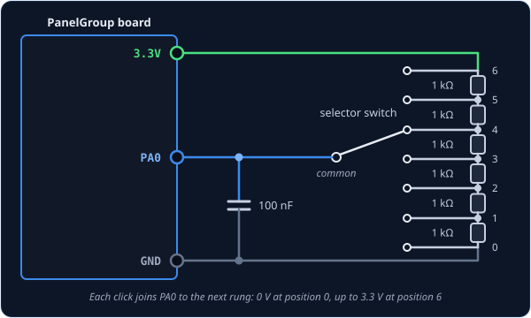

# AnalogMultiPos — rotary selector on one wire

`AnalogMultiPos` reads a rotary selector switch — a knob that clicks between positions, with a
pointer showing which one is selected — through a single wire. Instead of giving every position
its own pin, you fit a chain of resistors called a *resistor ladder* behind the switch, so each
position puts a different voltage on one pin. That makes it the way to wire a selector with more
positions than you have pins for, and the cockpit knob turns to the same position as yours.

!!! tip "Not quite the right part?"
    - **12 positions or fewer, and pins to spare?** Use [SwitchMultiPos](switchmultipos.md),
      which gives each position its own wire. There are no resistors to match and nothing to
      measure.
    - **A knob with no pointer that turns forever and clicks as it goes?** That's a rotary
      encoder — use [RotaryEncoder](rotaryencoder.md). Each click steps the cockpit selector
      one position.
    - **A knob that turns smoothly, without clicks?** That's a potentiometer — use
      [AnalogInput](analoginput.md).
    - **A toggle lever** rather than a knob? Use [Switch2Pos](switch2pos.md) for two positions
      or [Switch3Pos](switch3pos.md) for three.

## In your sketch

```cpp
const PinRef MCL_CHANNEL_PIN = PinRef(PA0);

OpenSkyhawk::AnalogMultiPos mclChannel(DCSIN_MCL_CHAN_SEL, MCL_CHANNEL_PIN, 20);
```

These two lines go near the top of your sketch, above `setup()`. The first is the
[pin address](../pin-addresses.md) of the one wire that carries the whole knob, here pin `PA0`
on the board. It has to be a pin that can measure a voltage, not just tell on from off.

The second line creates the selector. `mclChannel` is a name you choose, `DCSIN_MCL_CHAN_SEL` is
the cockpit control it operates, the 20-channel MCL selector, and `20` is how many positions the
knob has. Because the ladder spaces the positions in equal steps from 0 V to 3.3 V, that number
is all the board needs to work out which position you've picked.

## Wiring

For a knob with 20 positions, you need 19 identical resistors:

1. Chain the **19 × 1 kΩ resistors** end to end, and connect one end of the chain to **3.3V** and
   the other to **GND**.
2. Connect the switch's **position legs** to the chain in order: the first position to the GND
   end, each next position to the next joint between two resistors, and the last position to the
   3.3V end.
3. Connect the switch's **common** leg to the **pin**.
4. Fit a **100 nF capacitor** from the pin to **GND**.

The chain is called a ladder because each joint, or *rung*, sits one equal step higher in voltage
than the one below it, from 0 V at the bottom to 3.3 V at the top. As you turn the knob, the
common leg moves from rung to rung, so the board measures a different voltage at every position
and works out which one you picked. Use resistors that are all the same value, ideally with 1%
tolerance, because the steps are only equal if the resistors are.

The capacitor deals with the moment between clicks, when most switches briefly connect the
common leg to nothing at all. It holds the last voltage steady for that instant, so the board
doesn't misread the knob as it moves. The top of the ladder must go to 3.3V, never 5V, which can
damage the pin.

Only some of the board's pins can measure a voltage: `PA0` to `PA5`, `PB0` and `PB1`. They are
marked on the board, and any free one will do.



## Custom positions

The board measures the ladder as a number from 0 to 65535, from the GND end to the 3.3V end. With
the short line at the top of this page, the class assumes the positions are evenly spaced across
that range, which is exactly what a ladder of identical resistors gives. For 5 positions, it
expects readings of about 0, 16384, 32768, 49151 and 65535.

Sometimes the steps aren't even — a selector that came with its own resistors, a ladder built
from whatever values you had, or a knob that skips some of the cockpit's positions. Then you give
the class a list instead, with the reading you actually get at each position:

```cpp
const uint16_t MCL_CHANNEL_READINGS[] = {
        0,  3400,  6900, 10300, 13800, 17200, 20700, 24100, 27600, 31000,
    34500, 37900, 41400, 44800, 48300, 51700, 55200, 58600, 62100, 65535,
};

OpenSkyhawk::AnalogMultiPos mclChannel(DCSIN_MCL_CHAN_SEL, MCL_CHANNEL_PIN, 20,
                                       MCL_CHANNEL_READINGS);
```

The list has one number per position, in order from the first position to the last, and the
class places each position at its own number rather than assuming equal steps. If a position on
the cockpit knob has no click of its own on yours, put `ANALOG_NC` in its place: the board never
reports it, and its neighbours share its space.

To find your numbers, temporarily swap the selector's line for a plain knob,
`OpenSkyhawk::AnalogInput probe(DCSIN_MCL_CHAN_SEL, MCL_CHANNEL_PIN);`, and turn on the
[debug stream](../../../firmware/debugging.md#diagserial-the-debug-stream). Each time you click
to a new position you'll see a line like `[ANA] 0x806C: 34512`. Note the number at each
position, then put the selector's line back with your list.

## Troubleshooting

**The cockpit knob never moves, whatever position I pick.**
The wire is on a pin that can't measure a voltage. Move it to one of `PA0` to `PA5`, `PB0` or
`PB1`. Digital expanders and shift registers can't read a ladder at all.

**The cockpit knob turns the opposite way to mine.**
The two ends of the ladder are swapped. Swap the wires going to 3.3V and GND at the ends of the
chain, so the first position is at the GND end.

**One position lands on its neighbour, or doesn't register at all.**
The steps of the ladder aren't even, usually because one resistor is the wrong value or a joint
is poorly soldered. Check each resistor with a multimeter, or measure the positions and give the
class a list, as described in [Custom positions](#custom-positions).

**The cockpit knob jumps about while I'm turning mine.**
The 100 nF capacitor from the pin to GND is missing. Without it, the pin is connected to nothing
between clicks and the board reads whatever noise it picks up.

??? info "Going further"
    The board divides the full range of readings, 0 to 65,535, into a band for each position.
    Each band reaches half-way to its neighbours, minus a small gap of 1,000 at each edge. A
    reading that falls in a gap keeps the last position, so a knob sitting near a boundary can't
    flicker between two. One more number at the end of the line changes the size of that gap.

    The board reads the knob every 8 ms. Unlike a switch, there's no 20 ms settling time,
    because the gaps between the bands already do that job.

    The sim receives the same thing as from a [SwitchMultiPos](switchmultipos.md): the number
    of the selected position, starting from 0. When the board starts up, and whenever DCS asks
    for it, it reports the knob's current position.

    Every detail of the class is in the
    [API reference](../../../api/classOpenSkyhawk_1_1AnalogMultiPos.md).
