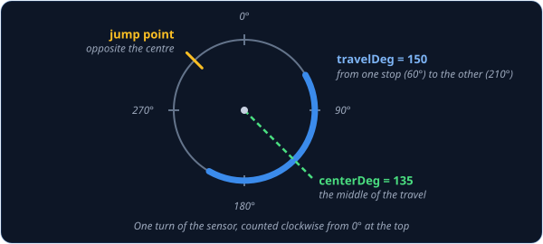
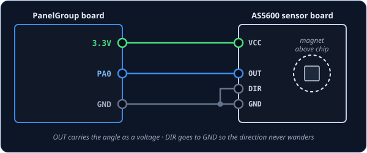

# AngleSensorInput — magnetic angle sensor knob

`AngleSensorInput` is for a knob with a small magnet on its shaft and a **magnetic angle sensor**
chip underneath, such as an AS5600 sensor board. The chip feels which way the magnet points and
turns that into a voltage, so it works like a potentiometer with nothing to rub or wear out. The
cockpit control follows yours smoothly, which suits knobs that have to sit at an exact spot, like
the gunsight elevation knob.

!!! tip "Not quite the right part?"
    - **An ordinary potentiometer knob or slider?** Use [AnalogInput](analoginput.md).
    - **A knob that clicks between a few fixed positions?** Use
      [SwitchMultiPos](switchmultipos.md), or [AnalogMultiPos](analogmultipos.md) if it's wired
      as a resistor ladder on a single pin.
    - **A knob that spins round and round without stopping?** That's a rotary encoder. Use
      [RotaryEncoder](rotaryencoder.md).

## In your sketch

```cpp
const PinRef GUNSIGHT_KNOB_PIN = PinRef(PA0);

OpenSkyhawk::AngleSensorInput gunsightKnob(DCSIN_GUNSIGHT_KNB, GUNSIGHT_KNOB_PIN, 135, 150);
```

These two lines go near the top of your sketch, above `setup()`. The first is the
[pin address](../pin-addresses.md), which says the sensor's output is wired to pin `PA0`. In the
second, `gunsightKnob` is a name you choose, and `DCSIN_GUNSIGHT_KNB` is the cockpit control it
turns. [DCS-BIOS Integration](../../../firmware/dcsbios-integration.md) explains where these names
come from.

The last two numbers describe your knob, because the sensor reads a whole circle but your knob
only turns part of the way round it. `150` is the **travel**: how many degrees your knob turns
from one stop to the other. `135` is the **centre**: where the sensor points when your knob is
halfway between its stops. The class lines those up with the cockpit knob, so your knob's two
stops become the cockpit knob's two ends. Every build's numbers are different, because they depend
on how the magnet happens to sit on the shaft, so you'll
[measure your own](#finding-your-two-numbers) once the knob is wired.



## Wiring

An AS5600 sensor board is wired like this:

1. **VCC** to **3.3V**.
2. **GND** to **GND**.
3. **OUT** to the **pin**.
4. **DIR** to **GND** as well.

`OUT` is the sensor's answer, a voltage between 0 V and 3.3 V that follows the magnet round the
circle. `DIR` sets which way round the sensor counts, and the chip needs it connected to
something, otherwise the direction can flip at random. Always power it from 3.3V, never 5V, because
the sensor's output would then go above 3.3 V and damage the board's analog pins. The magnet sits
on the end of the knob's shaft, centred over the chip and a couple of millimetres above it.

The sensor's output has to go to a pin that can measure a voltage: `PA0`, `PA1`, `PA2`, `PA3`,
`PA4`, `PA5`, `PB0` or `PB1`. They're marked as analog on the board.



## Finding your two numbers

You find the centre and the travel on your desk, by letting the board tell you what the sensor
reads. It takes five minutes, and you only do it once per knob.

1. Temporarily change the knob's line to a plain [AnalogInput](analoginput.md), which reports
   the sensor's raw reading. Then turn on the
   [debug stream](../../../firmware/debugging.md#diagserial-the-debug-stream) by adding one
   line at the start of `setup()`:

    ```cpp
    OpenSkyhawk::AnalogInput gunsightKnob(DCSIN_GUNSIGHT_KNB, GUNSIGHT_KNOB_PIN);   // just for measuring

    void setup() {
        STM32Board::setDebug(true);
        PanelGroup::setup();
    }
    ```

2. Upload the sketch and open the debug stream. Every time the knob moves, you'll see a line
   like `[ANA] 0x8055: 10920`.
3. Turn the knob slowly from one stop to the other, watching the number. It should change
   smoothly the whole way. If it suddenly jumps from a big number to a small one (or the other
   way), the sensor's zero is inside your knob's travel. Turn the magnet part of the way round
   on the shaft (half a turn is a good start) and try again, until the number changes smoothly
   from stop to stop.
4. Note the number at each stop, and divide each one by **182** to turn it into degrees.
5. The **travel** is the difference between the two, and the **centre** is halfway between them.

For example, if the stops read `10920` and `38220`, that's 60° and 210°. The travel is
210 − 60 = 150, and the centre is halfway between, 135. Put those two numbers into the
`AngleSensorInput` line, change it back from `AnalogInput`, and you're done. You can leave the
debug stream on while you test, but turn it off again before you fly.

## Troubleshooting

**The cockpit knob turns the opposite way to mine.**
Move the sensor board's `DIR` wire from GND to 3.3V, which makes the sensor count the other way
round. That changes every reading, so measure your two numbers again afterwards.

**The cockpit knob hits its end too early, or never quite gets there.**
The travel or the centre doesn't match your knob. Measure them again as above, and make sure the
magnet is glued or pinned firmly, so it can't slip on the shaft.

**The cockpit knob jumps from one end to the other partway through the turn.**
The sensor's zero has ended up inside your knob's travel, usually because the magnet slipped.
Fix it as in step 3 of [Finding your two numbers](#finding-your-two-numbers), then measure your
two numbers again.

**The number in the debug stream wobbles all over the place, or barely changes.**
The magnet is too far from the chip, or not centred over it. Bring it to a couple of millimetres
above the chip, directly over the middle.

??? info "Going further"
    Underneath, an `AngleSensorInput` is an [AnalogInput](analoginput.md) with angle maths
    added. It smooths the readings and ignores tiny wobbles in exactly the same way, and it
    reports its position when the board starts up and whenever DCS asks. Unlike `AnalogInput`,
    it doesn't take a reverse or dead-zone setting: the sensor's `DIR` pin sets the direction,
    and the dead zone stays at the standard 128 steps. A joystick axis ID such as `CTRL_ROLL`
    works in place of the cockpit control name, just as it does for `AnalogInput`.

    A sensor that reads a whole circle has to have a jump somewhere, because 0° and 360° are the
    same place. The class moves that jump to the point directly opposite your centre, as far from
    your knob's travel as it can go. That's why the travel has to be less than a full turn.

    The centre can even be given past 360°, so 370 means the same as 10. Past either end of the travel, the cockpit knob simply stays at its end.

    The MT6701 sensor chip works too, through its analog output. Check your sensor board's notes
    for which pin that is and how to set its direction.

    Every detail of the class is in the
    [API reference](../../../api/classOpenSkyhawk_1_1AngleSensorInput.md).
