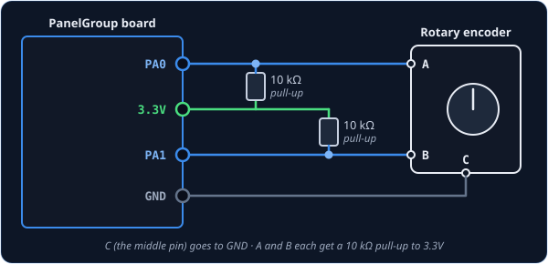
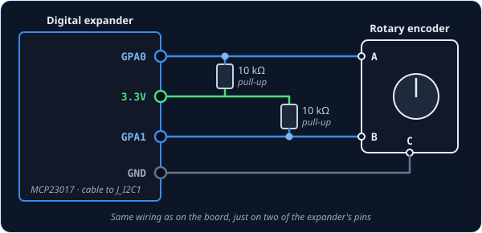
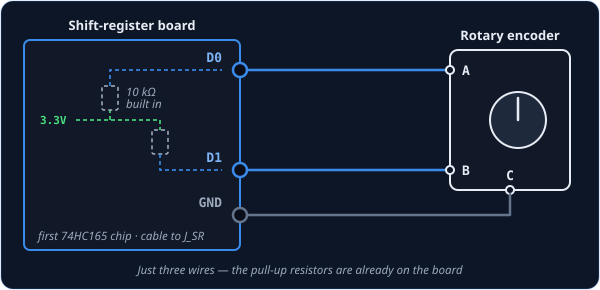

# RotaryAcceleratedEncoder — rotary encoder that speeds up

`RotaryAcceleratedEncoder` is for the same part as a [RotaryEncoder](rotaryencoder.md): a knob
that turns forever, with a click at each step. It's for the knobs you crank a long way, such as
winding a latitude in on the navigation computer. Turn it slowly and each click nudges the
cockpit knob a small amount, just like a plain encoder. Spin it quickly and each click moves the
knob much further, so you get where you're going in a few turns instead of dozens.

It also ignores the odd backwards blip. Cheap or worn encoders sometimes send a single click the
wrong way in the middle of a fast spin, and the board quietly drops it, so the cockpit knob keeps
moving the way your hand is turning.

!!! tip "Not quite the right part?"
    - **A knob you turn slowly, one click at a time?** A plain
      [RotaryEncoder](rotaryencoder.md) is all you need.
    - **Does the cockpit knob have a pointer or marked positions?** Use a selector switch instead:
      [SwitchMultiPos](switchmultipos.md) for up to 12 positions, or
      [AnalogMultiPos](analogmultipos.md) for more. A selector knows where it is pointing, so the
      sim matches it at startup; an encoder can't tell the sim where it is, only that it moved.

## In your sketch

Pick the tab that matches the cockpit control. A selector only gets the filter; a knob gets both
the filter and the speed-up.

=== "Stepping a selector (DIR)"

    ```cpp
    const PinRef FREQ_A_PIN = PinRef(PA0);
    const PinRef FREQ_B_PIN = PinRef(PA1);

    OpenSkyhawk::RotaryAcceleratedEncoder freq1MHz(DCSIN_ARC51_FREQ_1MHZ, FREQ_A_PIN, FREQ_B_PIN,
        OpenSkyhawk::EncoderStepsPerDetent::Four, OpenSkyhawk::EncoderMode::Dir);
    ```

    This turns the UHF radio's 1 MHz frequency wheel. A selector can only move one position
    per click, so in DIR mode there is no speed-up, and what you gain is the filter. Use it if
    a plain `RotaryEncoder` on a selector sometimes steps backwards while you turn.

=== "Turning a knob (REL)"

    ```cpp
    const PinRef PPOS_LAT_A_PIN = PinRef(PA0);
    const PinRef PPOS_LAT_B_PIN = PinRef(PA1);

    OpenSkyhawk::RotaryAcceleratedEncoder pposLat(DCSIN_PPOS_LAT_KNB, PPOS_LAT_A_PIN, PPOS_LAT_B_PIN,
        OpenSkyhawk::EncoderStepsPerDetent::Four, 3200, 12800);
    ```

    This turns the navigation computer's present-position latitude knob. The last two numbers
    set how far each click moves it: `3200` for a normal click and `12800` for a fast one, so a
    quick spin goes four times as far per click. A click counts as fast when it comes less than
    about a fifth of a second after the one before. You always write both numbers, and you can
    change either one to suit your knob.

Everything else in the line works exactly as it does for a
[RotaryEncoder](rotaryencoder.md#in-your-sketch). The first two lines are
[pin addresses](../pin-addresses.md) for the encoder's **A** and **B** pins, followed by a name
you choose and the cockpit control. `EncoderStepsPerDetent::Four` matches the four changes most
encoders make per click; the RotaryEncoder page explains how to check yours.

## Wiring

The wiring is exactly the same as for a [RotaryEncoder](rotaryencoder.md#wiring):

1. The middle pin, **C**, to **GND**.
2. Pin **A** to one pin, and pin **B** to another.
3. A **10 kΩ resistor** from each of those two pins to **3.3V**.

The resistors are pull-ups, which stop A and B flickering while they're open. Because this
encoder is made for spinning quickly, a shift register is the best place for it if you have one.

=== "On the board"

    

    You can use any two free pins on the board, named as they're printed next to each pin.

    ```cpp
    const PinRef PPOS_LAT_A_PIN = PinRef(PA0);
    const PinRef PPOS_LAT_B_PIN = PinRef(PA1);
    ```

=== "On a digital expander"

    

    The wiring is the same, just on two of the expander's pins. Any pins work except `GPA7`
    and `GPB7`, and the expander's two interrupt wires need to be connected so the board hears
    about every click straight away.

    ```cpp
    const PinRef PPOS_LAT_A_PIN = PinRef(expander1, PORT_A, 0);   // GPA0
    const PinRef PPOS_LAT_B_PIN = PinRef(expander1, PORT_A, 1);   // GPA1
    ```

    [Setting up a digital expander](../expanders.md#digital-expander-mcp23017) covers the lines
    your sketch needs for a first expander.

=== "On a shift register"

    

    Only three wires are needed, because shift-register boards come with the pull-up resistors
    already fitted.

    ```cpp
    const PinRef PPOS_LAT_A_PIN = PinRef(ShiftBus1, 0, 0);   // first chip, pin 0
    const PinRef PPOS_LAT_B_PIN = PinRef(ShiftBus1, 0, 1);   // first chip, pin 1
    ```

    Also add this line to your `platformio.ini`, under `build_flags`:

    ```ini
    -DSHIFTBUS_ISR_HZ=1000
    ```

    The board then reads the shift registers a thousand times a second on a timer, so even a
    fast spin never loses a click.
    [Setting up a shift-register chain](../expanders.md#shift-register-chain-74hc165-74hc595)
    explains how the chips are numbered.

## Troubleshooting

**When I reverse straight away, the first few clicks are ignored.**
That's the filter at work: a sudden change of direction mid-spin looks just like a blip. Pause
for half a second before turning back and the very first click will count.

**Spinning fast doesn't make the knob go any faster.**
Check that the second number is bigger than the first, for example `3200, 12800`. In DIR mode
there is no speed-up at all, and the first click after the board starts is always a normal one.

**Even slow clicks move the knob too far.**
Lower the first number. Half the number moves the knob half as far per click, and you'll
usually want to lower the second number to match.

**It turns the wrong way, or doesn't respond at all.**
These have the same causes and fixes as on a plain encoder; see the
[RotaryEncoder troubleshooting](rotaryencoder.md#troubleshooting).

??? info "Going further"
    A click is "fast" when it finishes less than **175 ms** after the one before. There are only
    two speeds, normal and fast, rather than a gradual ramp.

    The filter builds up *momentum* as you turn, up to four clicks' worth. While there is
    momentum, a change against it is dropped and only wears the momentum down, and after
    **500 ms** without a click it resets to zero. That's why a deliberate reversal from rest
    always counts, while a reversal in the middle of a spin takes a moment to register.

    Setting the second number to `0` turns the speed-up off and leaves only the filter, for a
    knob that should never speed up.

    Both behaviours match DCS-BIOS's `RotaryAcceleratedEncoder`, so if you're coming from
    DCS-BIOS, the knob feels the way you're used to.

    Every detail of the class is in the
    [API reference](../../../api/classOpenSkyhawk_1_1RotaryAcceleratedEncoder.md).
