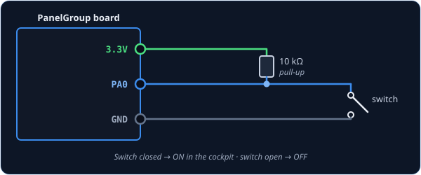
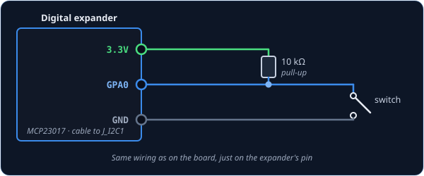
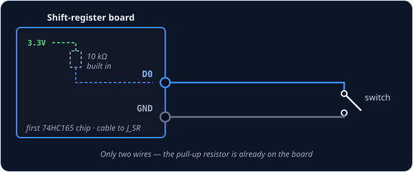

# Switch2Pos — two-position switch

Use `Switch2Pos` for anything with two states: a toggle switch, a slide switch, or a push-button.

The cockpit control **copies yours**. While your switch is on, the sim's is on. Turn yours off,
and the sim's goes off.

!!! tip "Not quite the right part?"
    - **Three positions** (ON–OFF–ON)? Use
      [Switch3Pos](../../../firmware/control-types.md#input-classes).
    - **A push-button, but the cockpit has a switch that stays put?** Use
      [ActionButton](../../../firmware/control-types.md#input-classes). Each press flips the
      switch, and it stays.
    - **A switch with a flip-up guard?** Use
      [SwitchWithCover2Pos](../../../firmware/control-types.md#input-classes).

## The short version

```cpp
const PinRef MASTER_ARM_PIN = PinRef(PA0);

Switch2Pos masterArm(DCSIN_ARM_MASTER, MASTER_ARM_PIN);
```

Put these two lines near the top of your sketch, above `setup()`.

That's all the code a switch needs. The board watches it and tells DCS every time it moves.

**What each part means:**

- **`masterArm`** — a name for this switch. Pick anything you like.
- **`DCSIN_ARM_MASTER`** — which cockpit control it operates. Every DCS-BIOS control has a name
  like this. See [DCS-BIOS Integration](../../../firmware/dcsbios-integration.md).
- **`MASTER_ARM_PIN`** — where the switch is wired. This is a
  [pin address](../pin-addresses.md).

## Wiring

Every switch is wired the same way:

1. One leg of the switch to the **pin**.
2. The other leg to **GND**.
3. A **10 kΩ resistor** from the pin to **3.3V**.

The resistor is called a *pull-up*. It holds the pin steady while the switch is open. The board
does not add one for you.

Pick the tab for where your switch is plugged in.

=== "On the board"

    

    Use any free pin. Its name (`PA0`, `PB1`, …) is printed next to it on the board.

    ```cpp
    const PinRef MASTER_ARM_PIN = PinRef(PA0);
    ```

=== "On a digital expander"

    

    Any pin except `GPA7` and `GPB7`.

    ```cpp
    const PinRef MASTER_ARM_PIN = PinRef(expander1, PORT_A, 0);   // GPA0
    ```

    New to expanders? [Setting up a digital expander →](../expanders.md#digital-expander-mcp23017)

=== "On a shift register"

    

    Only two wires here. The resistor is already on the shift-register board.

    ```cpp
    #include <Helpers/ShiftBus/ShiftBus.h>   // once, at the top of the sketch

    const PinRef MASTER_ARM_PIN = PinRef(ShiftBus1, 0, 0);   // first chip, pin 0
    ```

    New to shift registers? [Setting up a shift-register chain →](../expanders.md#shift-register-chain-74hc165-74hc595)

=== "As a joystick button"

    Wire it exactly like the first tab.

    Then use a **joystick button ID** instead of a cockpit control. Windows sees a
    game-controller button, which you can bind to anything in DCS's controls menu.

    ```cpp
    const PinRef TRIGGER_PIN = PinRef(PA1);

    Switch2Pos trigger(CTRL_TRIGGER, TRIGGER_PIN);
    ```

    Not sure which to use? See [DCS-BIOS vs HID](../../../architecture/dcsbios-vs-hid.md).

In every tab, only the pin address changes. The `Switch2Pos` line stays exactly the same.

## Troubleshooting

**The switch flickers, or DCS never sees it change.**
The pull-up resistor is missing. Add the 10 kΩ resistor from the pin to 3.3V.

**The cockpit shows ON when my switch is OFF.**
Add `true` at the end of the line:

```cpp
Switch2Pos masterArm(DCSIN_ARM_MASTER, MASTER_ARM_PIN, true);
```

??? info "Going further"
    - A change only counts once the switch has stayed put for **20 ms**. This filters out the
      tiny bounces every switch makes as it closes.
    - When the board starts, and whenever DCS asks, every switch reports where it is. A switch
      you moved while DCS was off catches up on its own.
    - Every detail is in the
      [API reference](../../../api/class_open_skyhawk_1_1_switch2_pos.md).
