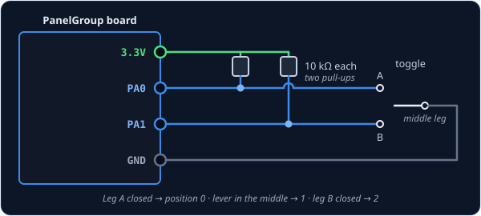
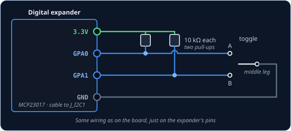
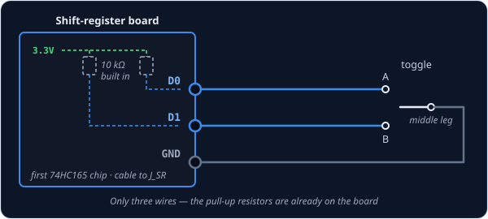

# Switch3Pos — three-position switch

`Switch3Pos` is for a toggle switch with three positions: up, middle and down. You'll often see
these sold as ON–OFF–ON switches, and the spring-loaded kind that snaps back to the middle when
you let go works just the same. The cockpit switch follows yours to all three positions, so the
middle is a real position too, not just "neither end".

!!! tip "Not quite the right part?"
    - **Only two positions** (ON–OFF)? Use [Switch2Pos](switch2pos.md).
    - **A rotary knob that clicks between positions, with a pointer?** Use
      [SwitchMultiPos](switchmultipos.md) for up to 12 positions, or
      [AnalogMultiPos](analogmultipos.md) for more than 12.
    - **A knob with no pointer that turns forever and clicks as it goes?** That's a rotary
      encoder — use [RotaryEncoder](rotaryencoder.md).

## In your sketch

```cpp
const PinRef BOMB_ARM_PIN_A = PinRef(PA0);
const PinRef BOMB_ARM_PIN_B = PinRef(PA1);

OpenSkyhawk::Switch3Pos bombArm(DCSIN_ARM_BOMB, BOMB_ARM_PIN_A, BOMB_ARM_PIN_B);
```

These lines go near the top of your sketch, above `setup()`. A three-position switch needs two
wires, one for each end of its travel, so it gets two [pin addresses](../pin-addresses.md)
instead of one — here pins `PA0` and `PA1` on the board.

The last line creates the switch. `bombArm` is a name you choose, and `DCSIN_ARM_BOMB` is the
cockpit control it operates, the bomb arm switch. The order of the two pins matters: when the
switch connects the first pin, the cockpit switch goes to one end, and when it connects the
second pin, it goes to the other. With neither connected, it sits in the middle.

## Wiring

A three-position switch has three legs, and it's wired like this:

1. The **middle leg** to **GND**.
2. One outer leg to the **first pin**, the other outer leg to the **second pin**.
3. A **10 kΩ resistor** from each pin to **3.3V** — two resistors in all.

The middle leg is the switch's *common*: moving the lever connects it to one outer leg or the
other, and in the middle position it connects to nothing. The board tells the three positions
apart by which pin, if either, is connected to GND. Each pin needs its own pull-up resistor for
the same reason a [two-position switch](switch2pos.md#wiring) does, because without one a pin
that isn't connected to anything flickers at random.

Where the two pins are depends on what you've plugged the switch into. Pick the tab that matches
your build — the wiring and the code look almost identical in each one.

=== "On the board"

    

    You can use any two free pins on the board. Each one has its name (`PA0`, `PB1`, and so
    on) printed next to it, and that name is what goes in the pin address.

    ```cpp
    const PinRef BOMB_ARM_PIN_A = PinRef(PA0);
    const PinRef BOMB_ARM_PIN_B = PinRef(PA1);
    ```

=== "On a digital expander"

    

    The wiring is exactly the same as on the board, just on two of the expander's pins. Any pins
    work except `GPA7` and `GPB7`, which can't read switches because of a fault in the chip.

    ```cpp
    const PinRef BOMB_ARM_PIN_A = PinRef(expander1, PORT_A, 0);   // GPA0
    const PinRef BOMB_ARM_PIN_B = PinRef(expander1, PORT_A, 1);   // GPA1
    ```

    If this is your first expander, your sketch also needs a couple of lines to set it up.
    [Setting up a digital expander](../expanders.md#digital-expander-mcp23017) walks through
    them.

=== "On a shift register"

    

    Here you only need three wires. Shift-register boards come with the pull-up resistors
    already fitted, so the outer legs go straight to two inputs and the middle leg to GND.

    ```cpp
    const PinRef BOMB_ARM_PIN_A = PinRef(ShiftBus1, 0, 0);   // first chip, pin 0
    const PinRef BOMB_ARM_PIN_B = PinRef(ShiftBus1, 0, 1);   // first chip, pin 1
    ```

    [Setting up a shift-register chain](../expanders.md#shift-register-chain-74hc165-74hc595)
    explains how the chips are numbered.

## Troubleshooting

**The switch flickers, or DCS never sees it change.**
This is almost always a missing pull-up resistor. Check that each of the two pins has its own
10 kΩ resistor to 3.3V.

**The cockpit switch goes up when mine goes down.**
The two pins are the wrong way round for this switch. Rather than rewiring it, swap the two pin
addresses in the last line:

```cpp
OpenSkyhawk::Switch3Pos bombArm(DCSIN_ARM_BOMB, BOMB_ARM_PIN_B, BOMB_ARM_PIN_A);
```

**One end works, but the other end shows as the middle.**
The leg on GND isn't the middle one. On some switches the common leg isn't where you'd expect,
so find it with a multimeter: it's the leg that connects to an outer leg in both end positions.
Put that one on GND.

**My switch has six legs.**
It's really two switches side by side that move together. Wire one row of three legs as shown
above and leave the other row empty.

??? info "Going further"
    Like every switch, a change only counts once the switch has stayed put for **20 ms**, which
    filters out the bounce as the contacts close. The sim receives the position as a number:
    `0` when the first pin is connected, `1` in the middle and `2` when the second pin is
    connected.

    If the two pins somehow both read as connected at once — which a real switch can't do, so it
    only happens for an instant during a bounce — the first pin wins.

    If you wire the middle leg to 3.3V instead of GND, with the resistors going to GND, add
    `true` at the end of the line and the board will read it the other way round. To change the
    20 ms settling time, add a number of milliseconds after that `true`, or after `false` if
    your switch is wired the usual way.

    When the board starts up, and whenever DCS asks for it, every switch reports its current
    position, so the sim catches up with anything you moved while it wasn't running.

    Every detail of the class is in the
    [API reference](../../../api/classOpenSkyhawk_1_1Switch3Pos.md).
