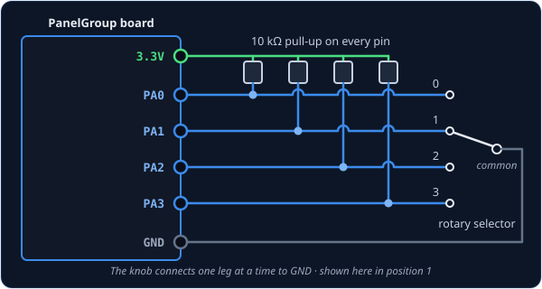
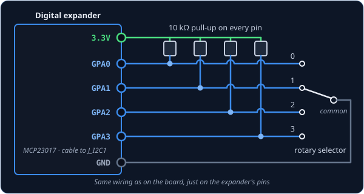
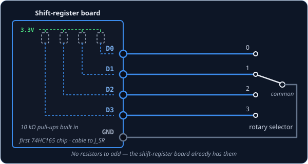

# SwitchMultiPos — rotary selector switch

`SwitchMultiPos` is for a rotary selector switch: a knob that clicks between a fixed set of
positions, with a pointer or markings showing which one is selected. Inside, the switch has one
leg for every position and a common leg that the knob connects to whichever position it's
pointing at. Each position gets its own wire, and the cockpit knob turns to the same position as
yours.

!!! tip "Not quite the right part?"
    - **More than 12 positions**, or not enough pins to give each one a wire? Use
      [AnalogMultiPos](analogmultipos.md), which reads the whole knob through a single pin.
    - **A knob with no pointer that turns forever and clicks as it goes?** That's a rotary
      encoder — use [RotaryEncoder](rotaryencoder.md). Each click steps the cockpit selector
      one position.
    - **A toggle lever** rather than a knob? Use [Switch2Pos](switch2pos.md) for two positions
      or [Switch3Pos](switch3pos.md) for three.

## In your sketch

```cpp
const PinRef RADIO_MODE_PINS[] = {
    PinRef(PA0),   // position 0
    PinRef(PA1),   // position 1
    PinRef(PA2),   // position 2
    PinRef(PA3),   // position 3
};

OpenSkyhawk::SwitchMultiPos radioMode(DCSIN_ARC51_MODE, RADIO_MODE_PINS, 4);
```

These lines go near the top of your sketch, above `setup()`. The UHF radio's mode knob has four
positions, so it needs four [pin addresses](../pin-addresses.md), and the first part keeps them
together in a list. The `[]` after the name says "this is a list", the curly braces hold the
addresses, and each one sits on its own line with a comma after it.

The order of the list is what tells the board which wire is which position. The first address is
the cockpit knob's first position, the next is the one after it, and so on round the dial. The
last line creates the selector: `radioMode` is a name you choose, `DCSIN_ARC51_MODE` is the
cockpit control it operates, and `4` is how many addresses are in the list. Keep the list at the
top of the sketch with everything else, because the selector reads from it the whole time the
board is running.

## Wiring

Every selector is wired the same way:

1. The **common** leg to **GND**.
2. Each position leg to its own **pin**, in the same order as your list.
3. A **10 kΩ resistor** from every pin to **3.3V**.

The common leg usually sits in the middle of the switch. Whichever position the knob points at,
that position's leg is connected to GND, and every other leg is connected to nothing. That's
why each pin needs its own pull-up resistor: like a [two-position switch](switch2pos.md#wiring),
a pin with nothing connected flickers at random unless a resistor holds it steady.

Many rotary switches have more legs than your cockpit knob has positions. Wire only the legs for
the positions your knob actually reaches, and leave the rest empty.

Where the pins are depends on what you've plugged the selector into. Pick the tab that matches
your build — the wiring and the code look almost identical in each one.

=== "On the board"

    

    You can use any free pins on the board. Each one has its name (`PA0`, `PB1`, and so on)
    printed next to it, and those names are what go in the list.

    ```cpp
    const PinRef RADIO_MODE_PINS[] = {
        PinRef(PA0), PinRef(PA1), PinRef(PA2), PinRef(PA3),
    };
    ```

=== "On a digital expander"

    

    The wiring is exactly the same as on the board, just on the expander's pins. Any pins work
    except `GPA7` and `GPB7`, which can't read switches because of a fault in the chip.

    ```cpp
    const PinRef RADIO_MODE_PINS[] = {
        PinRef(expander1, PORT_A, 0),   // GPA0
        PinRef(expander1, PORT_A, 1),   // GPA1
        PinRef(expander1, PORT_A, 2),   // GPA2
        PinRef(expander1, PORT_A, 3),   // GPA3
    };
    ```

    If this is your first expander, your sketch also needs a couple of lines to set it up.
    [Setting up a digital expander](../expanders.md#digital-expander-mcp23017) walks through
    them.

=== "On a shift register"

    

    Shift-register boards come with the pull-up resistors already fitted, so each position leg
    goes straight to an input and the common leg to GND.

    ```cpp
    const PinRef RADIO_MODE_PINS[] = {
        PinRef(ShiftBus1, 0, 0),   // first chip, pin 0
        PinRef(ShiftBus1, 0, 1),   // first chip, pin 1
        PinRef(ShiftBus1, 0, 2),   // first chip, pin 2
        PinRef(ShiftBus1, 0, 3),   // first chip, pin 3
    };
    ```

    [Setting up a shift-register chain](../expanders.md#shift-register-chain-74hc165-74hc595)
    explains how the chips are numbered.

## Troubleshooting

**The cockpit knob lands on the wrong position.**
The order of your list doesn't match the order of your wiring. Rather than rewiring the switch,
rearrange the addresses in the list until each position lands where it should.

**Turning to one position does nothing — the cockpit knob stays where it was.**
That position's leg isn't reaching its pin. When the board can't see any position, it keeps the
last one, so a missing wire looks like the knob refusing to move. Check that leg's wire and its
pull-up resistor.

**The cockpit knob never moves at all.**
Check that the common leg is connected to GND. Without it, none of the position legs can ever
connect anything.

??? info "Going further"
    Most rotary switches connect nothing at all for an instant as the knob moves between clicks.
    The board keeps the last position during that gap, so the sim never sees a stray jump. A new
    position only counts once the knob has rested there for **20 ms**, so if you spin quickly
    past several positions, the sim goes straight to the one you stop on.

    Some selectors have a position with no leg of its own, such as an OFF position that simply
    connects nothing. Put `PIN_NC` ("nothing connected") in its place in the list, and the board
    reports that position whenever none of the other legs is connected.

    If you wire the common leg to 3.3V instead of GND, with the resistors going to GND, add
    `true` at the end of the line and the board will read it the other way round.

    `SwitchMultiPos`, [AnalogMultiPos](analogmultipos.md) and [Switch3Pos](switch3pos.md) are
    built on the same foundation, `MultiPosInput`, and send the sim exactly the same thing: the
    number of the selected position, starting from 0. So you can rewire a selector from one
    wire per position to a resistor ladder without changing anything on the DCS side. The shared
    part is described in the
    [MultiPosInput API reference](../../../api/classOpenSkyhawk_1_1MultiPosInput.md).

    Every detail of the class is in the
    [API reference](../../../api/classOpenSkyhawk_1_1SwitchMultiPos.md).
