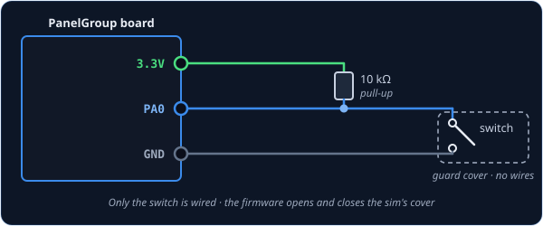
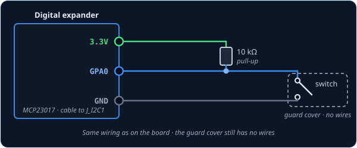
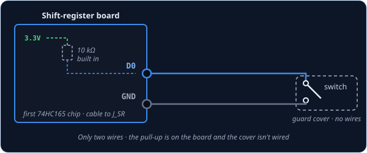

# SwitchWithCover2Pos — guarded two-position switch

`SwitchWithCover2Pos` is for a two-position switch that sits under a flip-up guard cover in the
cockpit. You wire just the switch, so your guard can be a real hinged cover, a printed one, or
nothing at all. When you flip it on, the board first opens the sim's guard cover and then turns
the switch on; when you flip it off, it turns the switch off and then closes the cover. So the
cockpit animates the way the real one would, and a sim that won't move the switch while its cover
is shut is kept happy.

!!! note "The A-4E-C has no guarded two-position switch"
    The A-4E-C's only guard cover sits over the AFCS 1-N-2 switch, which has three positions,
    and the mod doesn't check that cover before the switch moves. So on an A-4 build that switch
    is a [Switch3Pos](switch3pos.md), and this class goes unused. It exists to match DCS-BIOS,
    which has a control of the same name, and for other aircraft.

!!! tip "Not quite the right part?"
    - **No guard on the switch?** Use [Switch2Pos](switch2pos.md).
    - **Three positions** (ON–OFF–ON), guarded or not? Use [Switch3Pos](switch3pos.md).
    - **A push-button, but the cockpit has a switch that stays put?** Use
      [ActionButton](actionbutton.md).

## In your sketch

```cpp
const PinRef MY_SWITCH_PIN = PinRef(PA0);

// Replace DCSIN_MY_SWITCH and DCSIN_MY_SWITCH_COVER with your switch's and cover's names
OpenSkyhawk::SwitchWithCover2Pos mySwitch(DCSIN_MY_SWITCH, DCSIN_MY_SWITCH_COVER, MY_SWITCH_PIN);
```

These two lines go near the top of your sketch, above `setup()`, and they are all the code a
guarded switch needs. From then on the board watches the switch and moves both the cover and the
switch in the sim for you.

The first line says where the switch is wired — here, pin `PA0` on the board. This is called a
[pin address](../pin-addresses.md), and it is the only part that changes if you plug the switch
in somewhere else. The second line creates the guarded switch, and it takes two cockpit controls
because DCS-BIOS treats the cover as a control of its own. The switch's name goes first and the
cover's second. `DCSIN_MY_SWITCH` and `DCSIN_MY_SWITCH_COVER` are stand-ins, since the A-4E-C
has no pair to put here; a real cover name looks like `DCSIN_AFCS_1N2_COVER`.
[DCS-BIOS Integration](../../../firmware/dcsbios-integration.md) explains where to find these
names.

## Wiring

A guarded switch is wired exactly like any other switch, and the cover gets no wires:

1. One leg of the switch to the **pin**.
2. The other leg to **GND**.
3. A **10 kΩ resistor** from the pin to **3.3V**.

The resistor is called a *pull-up*. While the switch is open, nothing else connects the pin to
anything, so without the resistor it picks up electrical noise and flickers on and off at random.
The board doesn't add one for you, so every switch needs its own.

Where the pin itself is depends on what you've plugged the switch into. Pick the tab that matches
your build — the wiring and the code look almost identical in each one.

=== "On the board"

    

    You can use any free pin on the board. Each one has its name (`PA0`, `PB1`, and so on)
    printed next to it, and that name is what goes in the pin address.

    ```cpp
    const PinRef MY_SWITCH_PIN = PinRef(PA0);
    ```

=== "On a digital expander"

    

    The wiring is exactly the same as on the board, just on one of the expander's pins. Any pin
    works except `GPA7` and `GPB7`, which can't read switches because of a fault in the chip.

    ```cpp
    const PinRef MY_SWITCH_PIN = PinRef(expander1, PORT_A, 0);   // GPA0
    ```

    If this is your first expander, your sketch also needs a couple of lines to set it up.
    [Setting up a digital expander](../expanders.md#digital-expander-mcp23017) walks through
    them.

=== "On a shift register"

    

    Here you only need two wires. Shift-register boards come with the pull-up resistors already
    fitted, so the switch just goes between the input and GND.

    ```cpp
    const PinRef MY_SWITCH_PIN = PinRef(ShiftBus1, 0, 0);   // first chip, pin 0
    ```

    [Setting up a shift-register chain](../expanders.md#shift-register-chain-74hc165-74hc595)
    explains how the chips are numbered.

## Troubleshooting

**The switch flickers, or DCS never sees it change.**
This is almost always a missing pull-up resistor. Check that there is a 10 kΩ resistor between
the switch's pin and 3.3V.

**In the sim, the switch moves before the cover opens.**
The two names are the wrong way round. The switch's name goes first and the cover's second.

**The cockpit shows ON when my switch is OFF.**
Your switch is mounted or wired the other way round. Rather than rewiring it, add `true` at the
end of the line and the board will flip it for you:

```cpp
// Replace the two stand-in names, as above
OpenSkyhawk::SwitchWithCover2Pos mySwitch(DCSIN_MY_SWITCH, DCSIN_MY_SWITCH_COVER, MY_SWITCH_PIN,
                                          true);
```

??? info "Going further"
    The cover and the switch move **200 ms** apart, so the sim has time to swing the cover open
    before the switch goes over. The board keeps running everything else during that pause. If
    you flip the switch back before the sequence has finished, it simply walks back the way it
    came.

    Like [Switch2Pos](switch2pos.md), a change only counts once the switch has stayed put for
    **20 ms**, which filters out contact bounce.

    When the board starts up, and whenever DCS asks for it, the switch reports both the cover and
    the switch again, in the same order. DCS-BIOS's own version doesn't do this, but it means the
    sim catches up if you moved the switch while DCS wasn't running.

    If you'd rather sense a real cover, fit a small switch that closes when the cover opens and
    wire it as its own [Switch2Pos](switch2pos.md) on the cover's control. The guarded switch
    is then a plain `Switch2Pos` too, and you don't use this class.

    Every detail of the class is in the
    [API reference](../../../api/classOpenSkyhawk_1_1SwitchWithCover2Pos.md).
