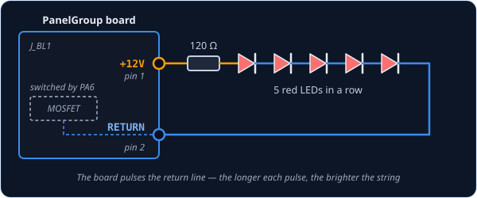
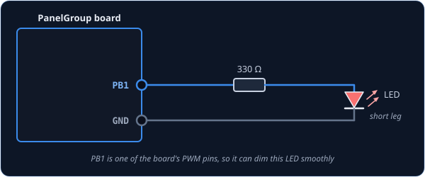

# Dimmer — dimmable backlight

`Dimmer` is for your panel's backlighting: the strings of LEDs behind the panel that light up the
legends and markings. It follows the cockpit's lighting knobs, so when you turn up the console
lights in DCS, your panel brightens to match, and when you turn them down, it fades with them.

!!! tip "Not quite the right part?"
    - **A light that is simply on or off**, like a warning lamp? Use [LED](led.md).
    - **Something none of the built-in classes cover**? Use
      [IntegerOutput](integeroutput.md), which hands the value to your own code.

## In your sketch

```cpp
const PinRef CONSOLE_LIGHTS_PIN = PinRef(PA6);   // backlight connector J_BL1

OpenSkyhawk::Dimmer consoleLights(A_4E_C_LIGHTS_CONSOLE, CONSOLE_LIGHTS_PIN);
```

These two lines go near the top of your sketch, above `setup()`, and they are all the code a
backlight needs. From then on the board sets the brightness by itself every time the knob in the
sim moves.

The first line is the [pin address](../pin-addresses.md). `PA6` is the pin that controls the
board's first backlight connector, `J_BL1`, so that's where the LEDs are plugged in. The second
line creates the dimmer. `consoleLights` is a name you choose, and `A_4E_C_LIGHTS_CONSOLE` is the
cockpit lighting it follows. Unlike an [LED](led.md), a dimmer only needs the one name, because
DCS sends each lighting level on its own.

## Wiring

The board has two backlight connectors, `J_BL1` and `J_BL2`, and each one dims its own string of
LEDs. A backlight string is wired like this:

1. Five red LEDs in a row, the short leg of each to the long leg of the next.
2. A **120 Ω resistor** from **pin 1** of the connector (+12V) to the first LED's long leg.
3. The last LED's short leg to **pin 2** of the connector (the return).

Five LEDs in a row use up most of the 12 V, and the resistor takes the rest, which holds the
string at about 18 mA. Pin 2 isn't a ground, though: the board switches it on and off a thousand
times a second, far too fast to see, and the longer it stays on each time, the brighter the string
looks.

This is called *PWM*, and only some of the board's pins can do it. That's also why a dimmer can't
go on an expander or a shift register: those chips can't switch a pin fast enough to dim, so the
board refuses rather than give you a backlight that only turns on and off.

=== "On a backlight connector"

    

    This is how every panel is lit. `J_BL1` is dimmed by pin `PA6` and `J_BL2` by pin `PA7`, so
    one board can follow two different knobs — the console lights on one connector and the
    instrument lights on the other.

    ```cpp
    const PinRef CONSOLE_LIGHTS_PIN    = PinRef(PA6);   // J_BL1
    const PinRef INSTRUMENT_LIGHTS_PIN = PinRef(PA7);   // J_BL2

    OpenSkyhawk::Dimmer consoleLights(A_4E_C_LIGHTS_CONSOLE, CONSOLE_LIGHTS_PIN);
    OpenSkyhawk::Dimmer instrumentLights(A_4E_C_LIGHTS_INSTRUMENTS, INSTRUMENT_LIGHTS_PIN);
    ```

    [Connector & Harness Guide](../../../hardware/connectors.md#backlight-single-zone-j_bl) shows
    the connector itself.

=== "On the board"

    

    For a single small LED on your desk, a few of the board's own pins can dim too: `PA0`, `PA1`,
    `PA2`, `PA3`, `PB0` and `PB1`. Wire the LED exactly as you would for an [LED](led.md#wiring),
    with its 330 Ω resistor.

    ```cpp
    const PinRef CONSOLE_LIGHTS_PIN = PinRef(PB1);
    ```

## Troubleshooting

**The backlight never comes on.**
Check that the dimmer is on `PA6`, `PA7` or one of the PWM pins listed above. Any other pin — an
expander pin, or `PA4`/`PA5` — can't dim, so the board leaves it switched off and, with
[debugging](../../../firmware/debugging.md) turned on, prints
`[Dimmer] pin is not a timer-capable GPIO — output disabled`.

**The backlight stays dark even with the right pin.**
It follows the sim exactly, so a dark cockpit means a dark panel. Make sure the aircraft has
electrical power and the matching lighting knob in the cockpit is turned up.

**The backlight is always at full brightness.**
The string is wired to GND instead of to pin 2 of the connector, so the board can't switch it.
Move that wire to pin 2.

??? info "Going further"
    DCS sends the lighting level as a number from 0 to 65535, and the board turns it into 256
    brightness steps. When the board starts up, every backlight is off and stays off until DCS
    sends its first level.

    LEDs look much brighter at low power than you'd expect, so the bottom of the knob's travel can
    seem too bright. You can reshape the response with a small function, added as a third
    argument. This one squares the value, so the low end dims much more gently:

    ```cpp
    uint16_t gentle(uint16_t value) {
        return (uint32_t)value * value >> 16;
    }

    OpenSkyhawk::Dimmer consoleLights(A_4E_C_LIGHTS_CONSOLE, CONSOLE_LIGHTS_PIN, gentle);
    ```

    There's no `true` to flip a dimmer the way there is for an [LED](led.md): a higher value is
    always brighter. If you ever need it the other way round, the same kind of function can
    return `65535 - value`.

    The A-4E has five lighting levels a dimmer can follow: `A_4E_C_LIGHTS_CONSOLE`,
    `A_4E_C_LIGHTS_INSTRUMENTS`, `A_4E_C_LIGHTS_FLOOD_RED`, `A_4E_C_LIGHTS_FLOOD_WHITE` and the
    radar scope glow, `A_4E_C_APG53A_GLOW`.

    `Dimmer` belongs to a small family of outputs that each take one cockpit value;
    [AnalogOutput](analogoutput.md) explains what they share.

    Every detail of the class is in the
    [API reference](../../../api/classOpenSkyhawk_1_1Dimmer.md).
