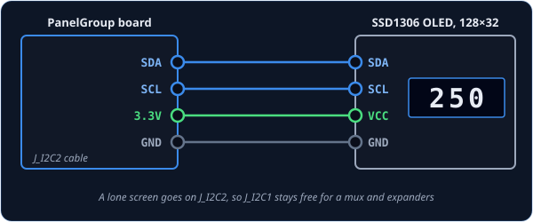
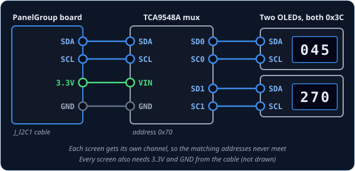

# DrumDisplay — rolling-drum number readout

`DrumDisplay` is for a small OLED screen standing in for one of the cockpit's mechanical number
counters, the rolling drums that show ground speed, a radio frequency, or latitude and
longitude. The screen it's built for is the common 0.91-inch SSD1306, 128 × 32 pixels. When the
sim's number changes, the digits roll into place like the real drums: the right-hand digit turns,
and the ones to its left click over as it carries. One `DrumDisplay` drives one screen.

!!! tip "Not quite the right part?"
    - **A gauge with a needle?** Use [NeedleGauge](needlegauge.md).
    - **A warning light that turns on and off?** Use [LED](led.md).
    - **A different kind of display, driven by your own code?** Use
      [IntegerOutput](integeroutput.md). It hands the value to you to show however you like.

## In your sketch

`DrumDisplay` lives in its own library, so that boards without a screen don't carry its code.
Add it once, as two extra lines at the end of the `lib_deps` list in your project's
`platformio.ini`. The second line is the screen library that draws the digits, which has to be
listed too:

```ini
lib_deps =
    ...
    DrumDisplay
    olikraus/U8g2@^2.35
```

Then the sketch itself:

```cpp
#include <DrumDisplay.h>

const OpenSkyhawk::DrumSource SPEED_DIGITS[] = {
    { A_4E_C_APN153_SPEED_X00, A_4E_C_APN153_SPEED_X00_AM, 1, 2 },   // hundreds
    { A_4E_C_APN153_SPEED_0X0, A_4E_C_APN153_SPEED_0X0_AM, 1, 1 },   // tens
    { A_4E_C_APN153_SPEED_00X, A_4E_C_APN153_SPEED_00X_AM, 1, 0 },   // units
};
const OpenSkyhawk::DrumReadout SPEED_READOUT = {
    .sources = SPEED_DIGITS, .nSources = 3, .nDigits = 3,
    .digitWidthMm = 4.5f, .digitHeightMm = 8.0f, .interDigitGapMm = 1.0f,
};

TwoWire Wire1(PB11, PB10);   // the J_I2C2 cable
U8G2_SSD1306_128X32_UNIVISION_F_2ND_HW_I2C speedScreen(U8G2_R0, U8X8_PIN_NONE);
OpenSkyhawk::DrumDisplay speedDrum(speedScreen, SPEED_READOUT, Wire1);

void setup() {
    Wire1.begin();
    speedScreen.setI2CAddress(0x3C << 1);
    speedScreen.begin();
    PanelGroup::setup();
}
```

This one shows the Doppler's three-digit ground-speed readout. The `#include` line goes at the
very top of the sketch, the lines inside `setup()` go into yours, and the rest goes above
it.

The A-4E doesn't send the speed as one number. It sends each digit on its own, the way each drum
turns on its own in the real instrument. So the readout starts with a list of **sources**, one
line per digit. Each line names a digit, then says it is `1` digit wide and which column it fills,
counting from the right and starting at 0. The hundreds digit is column 2, the tens column 1, and
the units column 0. Every name has a partner ending in `_AM`, which tells the board where to find
that digit in the data DCS sends; [DCS-BIOS Integration](../../../firmware/dcsbios-integration.md)
explains where to find these names.

`DrumReadout` gathers the sources into one readout. It says how many sources there are, how many
digits appear on screen, and how big to draw each digit, in millimetres. These sizes suit the
128 × 32 screen, and if a row turns out wider than the screen, it is shrunk to fit.

Unlike most controls, a drum display doesn't use a [pin address](../pin-addresses.md). The
screen plugs into an I²C cable instead: a two-wire cable that many parts can share, each answering
to its own address. The next three lines describe the cable and the screen.

`TwoWire Wire1(PB11, PB10);` gives the board's second I²C cable, `J_I2C2`, a name; the first
cable is already called `Wire`. The long `U8G2_...` line creates the screen itself, using the
U8g2 screen library, and `2ND_HW_I2C` in its name means it is on the second cable. Last,
`DrumDisplay` joins the screen, the readout and the cable together.

The lines inside `setup()` start the cable and wake the screen. `0x3C` is the screen's
*address*, its name on the cable, and nearly every one of these screens uses it. They must come
**before** `PanelGroup::setup()`, because that is when the readout measures the screen and clears
it ready for the first number.

## Wiring

Every screen has the same four pins:

1. `SDA` to the cable's **SDA**.
2. `SCL` to the cable's **SCL**.
3. `VCC` to **3.3V**.
4. `GND` to **GND**.

That's all it needs. The board already has the resistors that I²C needs fitted on both cables,
so there's nothing else to add.

How you connect the screen depends on how many you have. Pick the tab that matches your build.

=== "On its own cable"

    

    A single screen goes on the board's **second** I²C cable, `J_I2C2`, and must never share a
    cable with a mux full of screens (see the next tab and *Going further*). The code is the
    example at the top of this page.

=== "Through a mux"

    

    Because every screen has the same address, two screens on one cable would talk over each
    other. A **TCA9548A mux** solves this. It's a small switchbox with eight channels, and the
    board opens one channel at a time, so each screen gets a channel to itself. Wire the mux to
    `J_I2C1` like any other I²C part, connect all three of its address pins to GND (which gives it
    address `0x70`), and plug each screen into its own channel: `SD0` and `SC0` are channel 0,
    `SD1` and `SC1` channel 1, and so on.

    This example shows the navigation computer's wind speed and wind direction on two screens:

    ```cpp
    const OpenSkyhawk::DrumSource WIND_SPEED_DIGITS[] = {
        { A_4E_C_ASN41_WINDSPEED_X00, A_4E_C_ASN41_WINDSPEED_X00_AM, 1, 2 },
        { A_4E_C_ASN41_WINDSPEED_0X0, A_4E_C_ASN41_WINDSPEED_0X0_AM, 1, 1 },
        { A_4E_C_ASN41_WINDSPEED_00X, A_4E_C_ASN41_WINDSPEED_00X_AM, 1, 0 },
    };
    const OpenSkyhawk::DrumReadout WIND_SPEED_READOUT = {
        .sources = WIND_SPEED_DIGITS, .nSources = 3, .nDigits = 3,
        .digitWidthMm = 4.5f, .digitHeightMm = 8.0f, .interDigitGapMm = 1.0f,
    };

    const OpenSkyhawk::DrumSource WIND_DIR_DIGITS[] = {
        { A_4E_C_ASN41_WINDDIR_X00, A_4E_C_ASN41_WINDDIR_X00_AM, 1, 2 },
        { A_4E_C_ASN41_WINDDIR_0X0, A_4E_C_ASN41_WINDDIR_0X0_AM, 1, 1 },
        { A_4E_C_ASN41_WINDDIR_00X, A_4E_C_ASN41_WINDDIR_00X_AM, 1, 0 },
    };
    const OpenSkyhawk::DrumReadout WIND_DIR_READOUT = {
        .sources = WIND_DIR_DIGITS, .nSources = 3, .nDigits = 3,
        .digitWidthMm = 4.5f, .digitHeightMm = 8.0f, .interDigitGapMm = 1.0f,
    };

    OpenSkyhawk::I2cMux screenMux(0x70, Wire);   // the mux, on the J_I2C1 cable

    U8G2_SSD1306_128X32_UNIVISION_F_HW_I2C windSpeedScreen(U8G2_R0, U8X8_PIN_NONE);
    U8G2_SSD1306_128X32_UNIVISION_F_HW_I2C windDirScreen(U8G2_R0, U8X8_PIN_NONE);

    OpenSkyhawk::DrumDisplay windSpeedDrum(windSpeedScreen, WIND_SPEED_READOUT, screenMux, 0);   // channel 0
    OpenSkyhawk::DrumDisplay windDirDrum(windDirScreen, WIND_DIR_READOUT, screenMux, 1);         // channel 1

    void setup() {
        Wire.begin();

        screenMux.select(0);
        windSpeedScreen.setI2CAddress(0x3C << 1);
        windSpeedScreen.begin();

        screenMux.select(1);
        windDirScreen.setI2CAddress(0x3C << 1);
        windDirScreen.begin();

        PanelGroup::setup();
    }
    ```

    Two things change from the single screen. The screens use the plain `HW_I2C` version of the
    U8g2 line, because they are on the first cable, `Wire`. And each `DrumDisplay` takes the mux
    and a channel number instead of a cable. In `setup()`, open each screen's channel with
    `select()` just before waking it; once the board is running, it switches channels for you.

## Troubleshooting

**The screen stays blank.**
That's normal until you're sitting in a cockpit in a mission: a readout shows nothing until DCS
sends it its first number. If it's still blank in flight, check that the screen lines in `setup()`
come before `PanelGroup::setup()`, and that `SDA` and `SCL` aren't swapped. A few screens use
address `0x3D` instead of `0x3C`, set by a tiny link on the back.

**The build fails with an error about "designated initializers".**
The `.sources = …` style in the readout needs a newer version of C++. Projects copied from
`Firmware/Templates/PanelGroup` already ask for it; if yours doesn't, copy the `build_unflags` line
and the `-std=gnu++20` line from the template's `platformio.ini` into yours.

**Two screens behind the mux show each other's numbers, or one stays dark.**
Each `DrumDisplay` must name the channel its screen is actually plugged into, and in `setup()`,
every screen needs its own `select()` just before its `begin()`.

??? info "Going further"
    **Size and position.** Digits are drawn in `DrumFont::LARGE` by default. For a crowded
    readout, add `DrumFont::SMALL` after the cable or channel. Two more numbers after that nudge
    the whole row right and down, in millimetres, to line it up with the window in your
    faceplate:
    `OpenSkyhawk::DrumDisplay speedDrum(speedScreen, SPEED_READOUT, Wire1, OpenSkyhawk::DrumFont::LARGE, 0.5f, -0.25f);`.
    `setFontSize()` and `setOffset()` change them while the board is running.

    **Other screens.** The U8g2 line decides which screen you have. Its name spells out the
    screen — `SSD1306_128X32` is an SSD1306, 128 × 32 — so a larger SH1106 128 × 64 works too;
    just use its U8g2 name. The readout's millimetre sizes are converted for each screen when the
    board starts.

    **Why a lone screen keeps its own cable.** Every one of these screens answers to the same
    address. If a lone screen shared a cable with a mux, then whenever the mux opened a channel
    the board would see two screens with the same address and couldn't tell them apart. Keeping
    the lone screen on `J_I2C2` also leaves `J_I2C1` free for a mux and your expanders.

    **Readouts that aren't plain digits.** Most A-4E counters are ordinary 0–9 drums, which need
    nothing more. A few count differently: the ARC-51's 50 kHz drum moves in fives, and the
    altimeter setting's whole-inch drum only shows 29 or 30. Each source can describe its own
    steps with three optional fields, `steps`, `mul` and `offset`.

    **Letters, decimal points and leading zeros.** A readout can end in a hemisphere letter
    (N/S or E/W) with the readout's `flag`, include a fixed decimal point with `glyphs`, and
    hide leading zeros with `.leadingZero = OpenSkyhawk::LeadingZero::Suppress`.

    **When a screen stops answering.** If a screen or its mux is unplugged or fails, the board
    stops waiting on it, so the rest of the panel keeps working. It reports the fault to the
    rest of the cockpit, tries the screen again every two seconds, and picks it up by itself
    once it answers.

    Every detail of the classes is in the API reference for
    [DrumDisplay](../../../api/classOpenSkyhawk_1_1DrumDisplay.md) and
    [I2cMux](../../../api/classOpenSkyhawk_1_1I2cMux.md).
