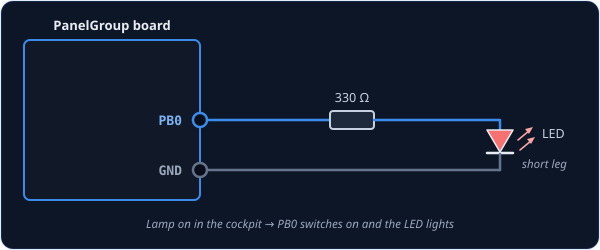
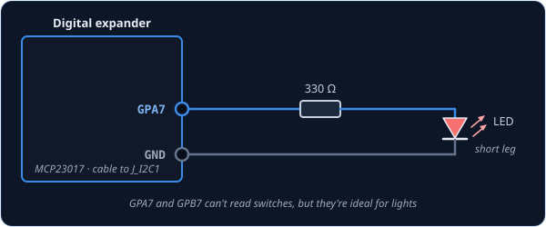
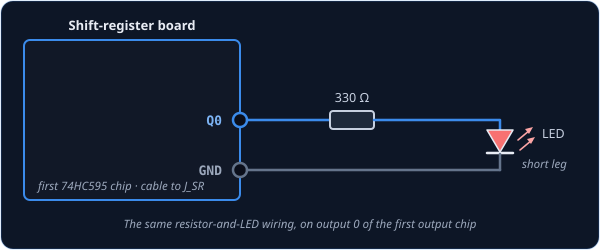

# LED — indicator light

`LED` is for a single indicator light: a warning lamp, a caution legend, a gear light, anything
in the cockpit that is simply on or off. Your LED copies the lamp in the sim, so when the FIRE
warning lights up in DCS, the one on your panel lights up too, and when the sim's goes out, so
does yours.

!!! tip "Not quite the right part?"
    - **A backlight that dims** with the cockpit's lighting knob? Use [Dimmer](dimmer.md).
    - **A gauge needle?** Use [NeedleGauge](needlegauge.md).
    - **A number readout**, like the drums on a radio? Use [DrumDisplay](drumdisplay.md).
    - **Your own display or gadget**, something none of these cover? Use
      [IntegerOutput](integeroutput.md), which hands the value to your own code.

## In your sketch

```cpp
const PinRef FIRE_LIGHT_PIN = PinRef(PB0);

OpenSkyhawk::LED fireLight(A_4E_C_D_GLARE_FIRE, A_4E_C_D_GLARE_FIRE_AM, FIRE_LIGHT_PIN);
```

These two lines go near the top of your sketch, above `setup()`, and they are all the code a
light needs. From then on the board switches the LED on and off by itself whenever the lamp in
the sim changes.

The first line says where the LED is wired — here, pin `PB0` on the board. This is its
[pin address](../pin-addresses.md), and it is the only part that changes if you plug the LED in
somewhere else. The second line creates the light. `fireLight` is a name you choose, and the two
names after it say which cockpit lamp to follow. They always come as a pair: the lamp's name, then
the same name again with `_AM` on the end, which picks your lamp out of the group DCS sends it in
(see *Going further*). [DCS-BIOS Integration](../../../firmware/dcsbios-integration.md) explains
where to find these names.

## Wiring

Every indicator LED is wired the same way:

1. The pin to a **330 Ω resistor**.
2. The other end of the resistor to the LED's **long leg**.
3. The LED's **short leg** to **GND**.

An LED on its own will draw as much current as it can get, which can burn out the LED and the pin
driving it. The resistor holds it to about 4 mA, which is plenty for an indicator lamp and well
within what any pin on the board, an expander or a shift register can supply. LEDs only work one
way round, so if one stays dark, the first thing to check is that the short leg goes to GND.

Pick the tab that matches where you've plugged the LED in. The wiring is the same in every one;
only the pin address changes.

=== "On the board"

    

    You can use any free pin on the board except `PC14`, which is too weak to light an LED. Each
    pin has its name (`PA0`, `PB1`, and so on) printed next to it, and that name is what goes in
    the pin address.

    ```cpp
    const PinRef FIRE_LIGHT_PIN = PinRef(PB0);
    ```

=== "On a digital expander"

    

    Every expander pin can drive a light, including `GPA7` and `GPB7`. Those two can't read
    switches, so lights are the perfect job for them.

    ```cpp
    const PinRef FIRE_LIGHT_PIN = PinRef(expander1, PORT_A, 7);   // GPA7
    ```

    If this is your first expander, your sketch also needs a couple of lines to set it up.
    [Setting up a digital expander](../expanders.md#digital-expander-mcp23017) walks through
    them.

=== "On a shift register"

    

    Lights go on the **output** chips in the chain, the 74HC595s. They're counted separately from
    the input chips, so the first output chip is chip 0 even if there are input chips before it.

    ```cpp
    const PinRef FIRE_LIGHT_PIN = PinRef(ShiftBus1, 0, 0);   // first output chip, pin 0
    ```

    [Setting up a shift-register chain](../expanders.md#shift-register-chain-74hc165-74hc595)
    explains how the chips are numbered.

## Troubleshooting

**The LED never lights.**
It is most likely in backwards. Turn it round so the short leg (the flat side of the case) goes to
GND. Also check that the cockpit lamp really is lit in the sim — your LED stays dark until DCS is
running and tells it otherwise.

**The LED is lit when the cockpit lamp is off.**
Your LED is wired the other way round from the steps above: its long leg goes to 3.3V and the pin
switches its short leg. Rather than rewiring it, add `true` at the end of the line and the board
will flip it for you:

```cpp
OpenSkyhawk::LED fireLight(A_4E_C_D_GLARE_FIRE, A_4E_C_D_GLARE_FIRE_AM, FIRE_LIGHT_PIN, true);
```

**A different lamp's light comes on.**
The two names don't match. Both must be the same lamp — `A_4E_C_D_GLARE_FIRE` with
`A_4E_C_D_GLARE_FIRE_AM`, not with another lamp's `_AM`.

**A blue, white or green LED is very dim.**
These colours need almost all of the 3.3V just to light, which leaves nothing for the resistor to
work with. Red, yellow and orange LEDs are the right choice for indicator lamps.

??? info "Going further"
    When the board starts up, every light is switched off and stays off until DCS sends its first
    update. That happens as soon as the board connects, so your panel catches up with the cockpit
    within a moment of DCS running.

    The two names come as a pair because DCS doesn't send its lamps one at a time. It packs them
    into groups of up to sixteen and sends a whole group at once — the fire warning shares its
    group with fifteen other lamps, including the gear light and the rest of the glareshield
    warnings. The first name picks the group and the `_AM` name picks your lamp out of it, so you
    never have to work anything out yourself.

    The `true` at the end of the line is for panels whose circuit board ties every LED's long leg
    to 3.3V and lets the pin switch the short leg to GND. Both ways work equally well; `true` just
    tells the board which one you used.

    The 330 Ω resistor suits one small indicator LED. Anything hungrier — a bright lamp, several
    LEDs on one pin, or a light powered from 5V or 12V — needs a small transistor between the
    pin and the light. The
    [Hardware Standards](../../../hardware/standards.md#shift-register-io-74hc165-74hc595-shiftbus)
    page has the rule for shift-register outputs.

    Every detail of the class is in the
    [API reference](../../../api/classOpenSkyhawk_1_1LED.md).
