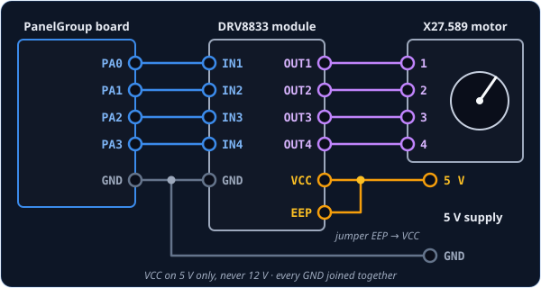
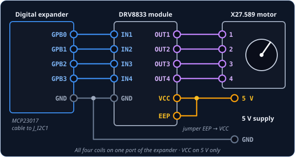
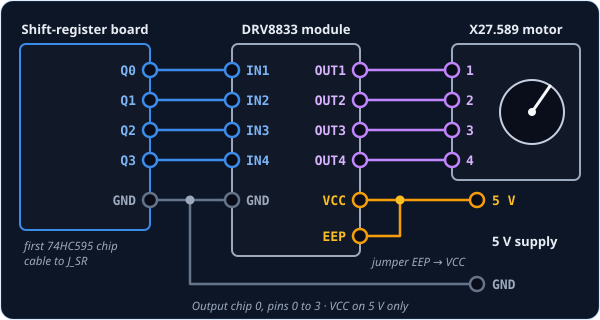

# NeedleGauge — gauge needle

`NeedleGauge` is for a gauge whose needle is turned by a small stepper motor: the X27.589, or
one of its look-alikes such as the VID-29 and BKA-30, the same motors found behind car
dashboards. The sim tells the board where its needle points, and the board moves yours to match,
easing in and out of every move like the real instrument. A motor needs more power than the
board's pins can give, so it runs through a small **DRV8833** driver board that does the heavy
lifting.

!!! tip "Not quite the right part?"
    - **A number readout rather than a needle?** Use [DrumDisplay](drumdisplay.md).
    - **A warning light that turns on and off?** Use [LED](led.md).
    - **A servo, or a gadget of your own?** Use [IntegerOutput](integeroutput.md). It hands
      the gauge's value to your own code.

## In your sketch

```cpp
const PinRef OIL_COIL_1 = PinRef(PA0);
const PinRef OIL_COIL_2 = PinRef(PA1);
const PinRef OIL_COIL_3 = PinRef(PA2);
const PinRef OIL_COIL_4 = PinRef(PA3);

const OpenSkyhawk::StepperConfig OIL_MOTOR = OpenSkyhawk::makeX27Config(0, 0, 0, 810);
OpenSkyhawk::StepperMotor oilMotor(OIL_COIL_1, OIL_COIL_2, OIL_COIL_3, OIL_COIL_4, OIL_MOTOR);

const OpenSkyhawk::GaugeCal OIL_SCALE = { 0, 810, false, nullptr, nullptr, 0 };
OpenSkyhawk::NeedleGauge oilPressure(A_4E_C_OIL_PRESSURE, A_4E_C_OIL_PRESSURE_AM, oilMotor, OIL_SCALE);
```

A gauge takes a few more lines than a switch, because it is made of parts that work together:
a motor, a scale, and the gauge that joins them. All of it goes above `setup()`, and nothing
needs to go inside it. The board takes it from there, setting the needle up when it starts and
moving it every time DCS sends a new value.

The first four lines are [pin addresses](../pin-addresses.md), one for each wire to the driver.
The motor has two coils inside it, and each coil needs two wires, so a gauge always uses four
pins.

`makeX27Config` describes the motor. It fills in everything the X27 family has in common, so you
only give four numbers, all counted in **steps**. The motor turns a third of a degree per step,
so 3 steps make 1°. The first two numbers are the step number of the end stop and where the
needle rests after start-up, both 0 here, and the last two are how far it may travel: 0 to 810
steps, or 270°, because that's how far round the oil-pressure dial goes. `StepperMotor` is then
the motor itself, built from its four coil pins and that description.

`GaugeCal` is the gauge's scale. It says where the needle points when DCS sends its lowest value
(0 steps) and its highest (810 steps), and every value in between is spread evenly across that
range. `false` means the needle isn't reversed, and you can leave the last three entries as they
are; they're for unevenly printed dials (see *Going further*).

Finally, `NeedleGauge` ties the motor and the scale to a cockpit gauge. `oilPressure` is a name
you choose, and `A_4E_C_OIL_PRESSURE` is the gauge it follows. Every gauge has a second name
ending in `_AM`, which tells the board where to find that gauge's value in the data DCS sends.
[DCS-BIOS Integration](../../../firmware/dcsbios-integration.md) explains where to find these
names.

## Wiring

Every gauge is wired the same way:

1. Four pins to the driver's inputs, in order: the first to `IN1`, the second to `IN2`, the
   third to `IN3` and the fourth to `IN4`.
2. The motor's four pins, in order, to the driver's outputs `OUT1` to `OUT4`.
3. The driver's `VCC` to **5V**, and its `GND` to the board's **GND**.
4. A wire link from the driver's `EEP` pin to its own `VCC` pin.

The driver's power must be **5V, never the 12V rail**: the X27 is built for 5 V, and the
DRV8833 is rated for at most 10.8 V. Take it from the cockpit's 5V supply
(see [Power Architecture](../../../architecture/power.md)), and make sure the supply, the driver
and the board all share GND, because without a common ground the signals mean nothing.

The last step catches almost everyone. `EEP` is the driver's sleep pin (the end of *SLEEP*,
printed too small to fit), and while it's low the motor is completely dead, without even a buzz.
The module's solder bridge meant to keep it awake usually arrives open, so add the link yourself.

Where the four coil wires start depends on what you've plugged the gauge into. Pick the tab that
matches your build — the driver and motor side is the same in every one.

=== "On the board"

    

    Any four free pins work except `PC14`, a weak pin that can only be used for inputs, and
    `PA0` to `PA3` are a handy choice because they sit side by side. The board's own pins drive the
    needle as fast as the motor can go.

    ```cpp
    const PinRef OIL_COIL_1 = PinRef(PA0);
    const PinRef OIL_COIL_2 = PinRef(PA1);
    const PinRef OIL_COIL_3 = PinRef(PA2);
    const PinRef OIL_COIL_4 = PinRef(PA3);
    ```

=== "On a digital expander"

    

    Put all four coils on the **same port** of the expander, such as `GPB0` to `GPB3`, or the
    board refuses to drive the motor, and leave the other pins of that port unused. An expander
    is fine for slow gauges like oil pressure or fuel, but too slow for a needle that swings
    quickly.

    ```cpp
    const PinRef OIL_COIL_1 = PinRef(expander1, PORT_B, 0);   // GPB0
    const PinRef OIL_COIL_2 = PinRef(expander1, PORT_B, 1);   // GPB1
    const PinRef OIL_COIL_3 = PinRef(expander1, PORT_B, 2);   // GPB2
    const PinRef OIL_COIL_4 = PinRef(expander1, PORT_B, 3);   // GPB3
    ```

    If this is your first expander, your sketch also needs a couple of lines to set it up.
    [Setting up a digital expander](../expanders.md#digital-expander-mcp23017) walks through
    them.

=== "On a shift register"

    

    The coils go on the 74HC595 *output* chips, here pins 0 to 3 of the first one. This is the
    best home for gauges: a shift register moves the needle at full speed, and one chain can
    drive up to 16 gauges.

    ```cpp
    const PinRef OIL_COIL_1 = PinRef(ShiftBus1, 0, 0);   // output chip 0, pin 0
    const PinRef OIL_COIL_2 = PinRef(ShiftBus1, 0, 1);
    const PinRef OIL_COIL_3 = PinRef(ShiftBus1, 0, 2);
    const PinRef OIL_COIL_4 = PinRef(ShiftBus1, 0, 3);
    ```

    [Setting up a shift-register chain](../expanders.md#shift-register-chain-74hc165-74hc595)
    explains how the chips are numbered.

## Troubleshooting

**It buzzes against the stop for a couple of seconds at start-up.**
That's normal. The board is *homing* the needle, finding zero before it starts following DCS, and
*Going further* explains how.

**The needle is completely dead — not even a buzz at start-up.**
The driver is almost certainly asleep. Check the link from `EEP` to `VCC`, then check that `VCC`
really has 5 V and that the driver's GND is joined to the board's. On an expander, also check that
all four coils are on the same port.

**The needle twitches or buzzes but never sweeps.**
The motor's coils are mixed up. Check that the motor's pins 1 to 4 go to `OUT1` to `OUT4` in
order, and that the four board pins go to `IN1` to `IN4` in the same order as in your sketch.

**The needle moves the wrong way, or homes against the wrong end.**
The motor is wired the other way round. Rather than rewiring it, swap the first two coils in the
`StepperMotor` line:

```cpp
OpenSkyhawk::StepperMotor oilMotor(OIL_COIL_2, OIL_COIL_1, OIL_COIL_3, OIL_COIL_4, OIL_MOTOR);
```

**At rest, the needle sits a little off the dial's zero mark.**
The motor's end stop doesn't quite line up with the printed zero. Let the board finish homing,
then pull the needle off its shaft and press it back on pointing exactly at zero.

??? info "Going further"
    **Homing.** A stepper motor has no idea where its needle is when the power comes on, so when
    the board starts, it homes each needle first. It turns the needle gently against its end stop
    at the zero end of the dial for about two seconds and calls that spot zero, and from then on
    it counts every step, so it always knows where the needle is. Homing happens inside
    `PanelGroup::setup()`, one gauge after another, so a panel with several gauges takes a few
    seconds to start.

    **Homing with a switch instead of the end stop.** Some gauges have a small switch or sensor
    that the needle trips at zero. Add `HomeMode::SENSOR` to `makeX27Config`, and give
    `StepperMotor` the switch's pin address after the description. Wire the switch exactly like a
    [Switch2Pos](../inputs/switch2pos.md), to GND with a 10 kΩ pull-up. The board turns the
    needle until the switch closes, and gives up after 2,000 steps if it never does.

    ```cpp
    const PinRef OIL_HOME_SWITCH_PIN = PinRef(PA4);

    const OpenSkyhawk::StepperConfig OIL_MOTOR =
        OpenSkyhawk::makeX27Config(0, 0, 0, 810, OpenSkyhawk::HomeMode::SENSOR);
    OpenSkyhawk::StepperMotor oilMotor(OIL_COIL_1, OIL_COIL_2, OIL_COIL_3, OIL_COIL_4, OIL_MOTOR,
                                       OIL_HOME_SWITCH_PIN);
    ```

    **Driving the sleep pin instead of linking it.** Our own panel boards wire the driver's
    sleep pin to an output, with a resistor that keeps the driver asleep until the board is
    ready. Pass that pin last, with `PIN_NC` standing in for the home switch you don't have,
    and leave out the `EEP` link:
    `OpenSkyhawk::StepperMotor oilMotor(OIL_COIL_1, OIL_COIL_2, OIL_COIL_3, OIL_COIL_4, OIL_MOTOR, PIN_NC, PinRef(ShiftBus1, 0, 4));`

    **Unevenly printed dials.** On some dials the marks aren't evenly spaced, so a straight
    line from lowest to highest puts the needle in the wrong place in between. The last three
    `GaugeCal` entries take a short table instead: a list of DCS values in rising order, the
    needle position (in steps) for each, and how many there are. The board draws straight
    lines between your points.

    **What `makeX27Config` fills in for you.** 1,080 steps per full turn, and 945 steps
    (about 315°) between the motor's two end stops. Homing drives that distance plus an eighth,
    so it reaches the stop from anywhere. A motor with different stops, such as a 320° BKA-30,
    takes its own value; the full list of options is in the API reference.

    **Smooth moves.** Every move speeds up and slows down gently, using the same motion as
    Guy Carpenter's SwitecX25 library. Changes of a single step are ignored, so a value that
    flickers in the sim doesn't make the needle shiver.

    **Why an expander's coils share a port.** The expander can only change all four coils in a
    single message when they share a port. Split across two ports, the needle would stutter
    through half-changed coils, so the board refuses to drive it at all. Each step also rewrites
    the whole port at once, which is why the port's other pins must stay unused.

    **How fast each connection is.** Measured on the bench, the board's own pins reach about
    1,667 steps a second and a shift register about 1,137, both limited by the motor rather than
    the connection. An expander managed about 490 steps a second, roughly 160° a second, but that
    was with the I²C cable running at 400 kHz. The board's I²C runs slower than that unless you
    change it, and at the usual 100 kHz an expander manages nearer 260 steps a second.

    Every detail of the classes is in the API reference for
    [NeedleGauge](../../../api/classOpenSkyhawk_1_1NeedleGauge.md) and
    [StepperMotor](../../../api/classOpenSkyhawk_1_1StepperMotor.md).
