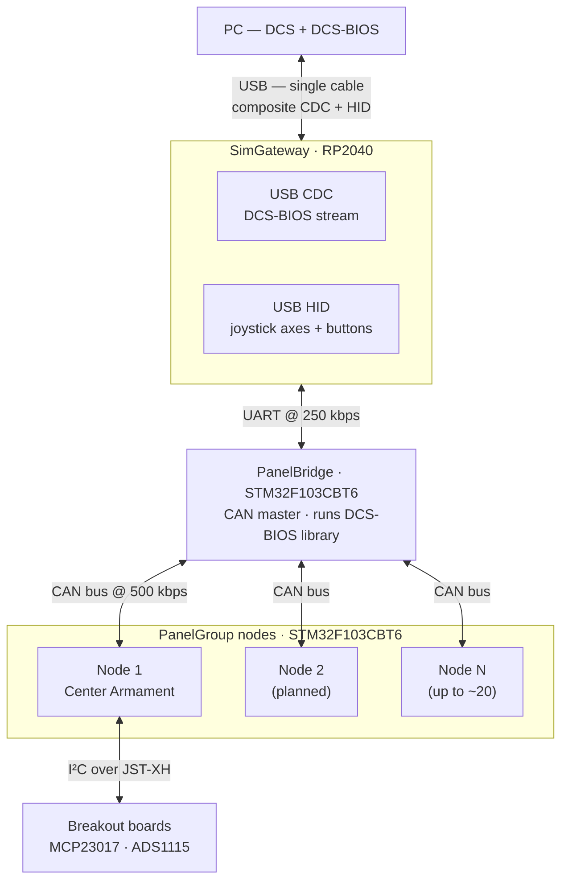

# How the System Works

OpenSkyhawk connects a physical A-4E-C cockpit to DCS over a **single USB cable**. Behind
that cable is a three-tier firmware stack and a CAN bus that ties every panel together.
This page traces how it fits, then follows one button press all the way from the cockpit
into the sim.

## The problem it solves

A home pit built from off-the-shelf controllers is a pile of separate USB devices — one per
panel, each with its own port, bindings, and profile. Windows caps you at eight HID
joysticks, the wiring sprawls, and every new panel is another device to map. OpenSkyhawk
collapses all of that onto **one USB connection** and a shared bus.

## The three tiers

| Tier | MCU | Role |
|------|-----|------|
| **SimGateway** | RP2040 | The single USB device the PC sees. A composite USB device: CDC for the DCS-BIOS stream, HID for flight-control axes and buttons. Relays raw bytes to PanelBridge over UART. Does **not** run the DCS-BIOS library. |
| **PanelBridge** | STM32F103CBT6 | The CAN master. Runs the DCS-BIOS library on its UART. Broadcasts every DCS output onto the CAN bus, and routes input events coming back up from the nodes. One per cockpit. |
| **PanelGroup** | STM32F103CBT6 | One per panel group. A CAN sub-node. Drives its panel hardware directly (GPIO, or MCP23017 / ADS1115 breakouts over I²C) and fires input events back onto the bus. Each has a unique `NODE_ID` (1–63). |

Each PanelGroup node carries a `NODE_ID` baked in at compile time via `platformio.ini`. Node
0 is reserved for PanelBridge. See the [NODE_ID registry](../firmware/node-id.md) for the
current assignments.

## How a button press travels

Follow a single switch flip on a panel all the way into DCS:

1. **You flip a switch.** A PanelGroup node polls its inputs and notices the change.
2. **The node fires a CAN event.** It sends an `EVT` frame onto the bus carrying a
   `ControlPacket` — a 4-byte `{ controlId, value }` pair. The `controlId` says *what* the
   control is; the `value` says its new state.
3. **PanelBridge receives it.** As CAN master it picks up the `EVT` frame and looks at the
   `controlId`. For a panel switch this lands in the DCS-BIOS range (`0x8000`–`0x86FF`), so
   PanelBridge translates it into a DCS-BIOS command and writes the ASCII out over UART.
4. **SimGateway relays the bytes.** It forwards the UART bytes straight onto USB CDC without
   parsing them — a pure byte relay.
5. **DCS acts on it.** DCS-BIOS on the PC receives the command and the switch moves in the
   sim.

The output path runs the same way in reverse: DCS-BIOS streams a state change → USB CDC →
SimGateway relays it → PanelBridge runs the DCS-BIOS library and broadcasts a `CTRL_BCAST`
frame on CAN → every PanelGroup node updates its LEDs, gauges, and backlight.

Everything on the bus uses the **same `ControlPacket` format**. There's no separate channel
for inputs versus outputs versus flight controls — just one packet type, routed by its
`controlId`.

## DCS-BIOS vs HID — the short version

The `controlId` decides which of two paths a control takes:

- **DCS-BIOS path** (`controlId` `0x8000`–`0x86FF`) — for any control with a DCS-BIOS
  address. State is managed by DCS-BIOS and syncs automatically. **Zero manual binding.**
  This is the default for panel controls.
- **HID path** (`controlId` `< 0x8000`) — for controls with no DCS-BIOS address: flight
  stick / throttle / rudder axes, and purely momentary controls. Handled entirely at the
  SimGateway layer as joystick axes and buttons — PanelBridge never sees them. **Requires
  manual DCS binding or a provided profile.**

The rule of thumb: **default to DCS-BIOS, reach for HID only when there's no address or it's
a flight-control axis.** The full reasoning, the complete `controlId` range table, and
worked examples are on the [DCS-BIOS vs HID](../architecture/dcsbios-vs-hid.md) page.

## What's built, what's planned

!!! note "Honest status"
    - **Built and hardware-verified:** the three-tier firmware backbone, the CAN protocol,
      DCS-BIOS integration, and the first input (Switch2Pos) and output (LED) types. The
      Armament Group has real host and breakout hardware.
    - **Not yet built:** most input and output control types, the Armament Group panel
      firmware (still a stub), the rest of the consoles and instruments, and the replica
      HOTAS. These are designed or scoped but not implemented — they're marked clearly
      wherever they appear in these docs.

## CAN bus, briefly

The bus runs at **500 kbps** over a two-wire differential pair (CANH/CANL), daisy-chained
across every board, with **120 Ω termination at the two physical end nodes only**. Each
STM32 board uses an SN65HVD230 transceiver (SOIC-8, 3.3 V).

!!! warning "Blue Pill clones need SJW = 4TQ"
    STM32F103 Blue Pill clones require the CAN synchronization jump width set to **4TQ** for
    reliable operation — crystal-to-crystal tolerance causes intermittent CRC errors at
    lower values. See [Design Decisions](../architecture/design-decisions.md) for the soak
    test data and the rest of the CAN configuration requirements.

For the full protocol — frame ID table, `ControlPacket` wire format, batching, and the
startup handshake — see [CAN Bus Protocol](../architecture/can-bus.md).
