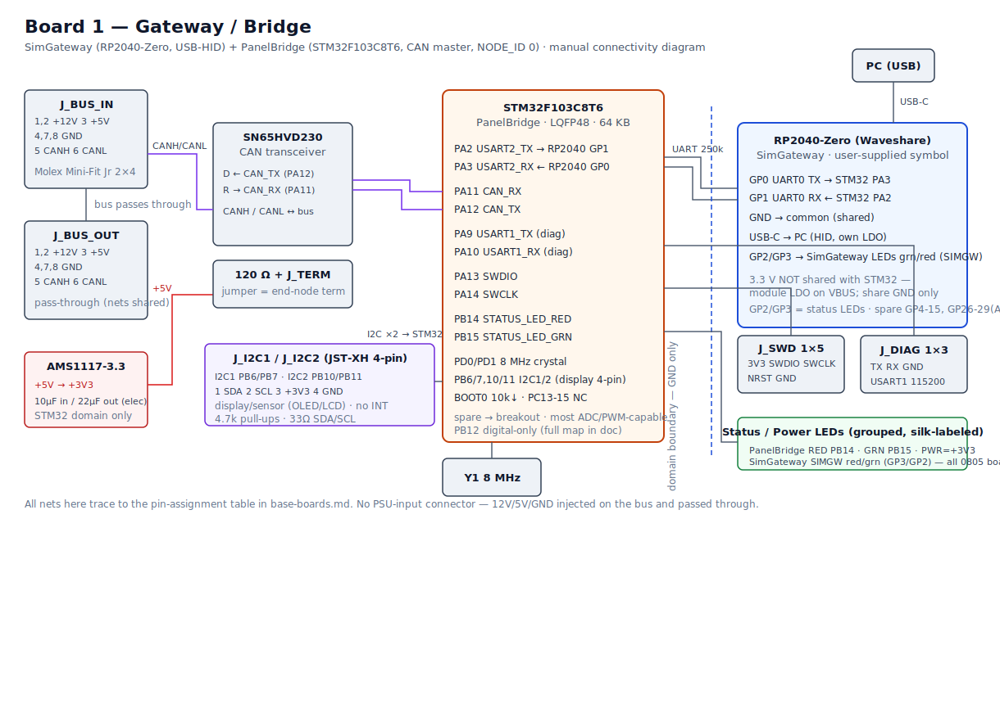
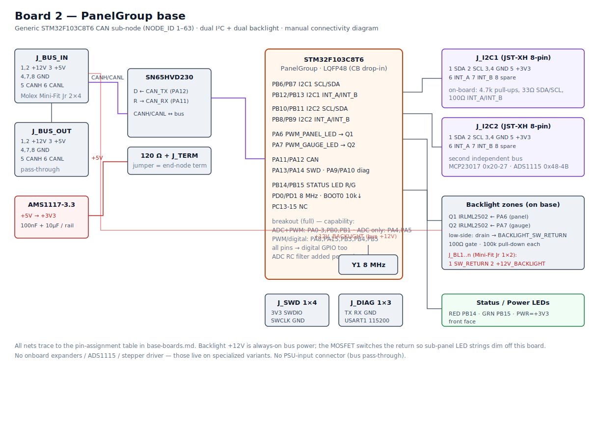

# Base Boards — Gateway/Bridge & PanelGroup

Two **reusable base boards** anchor every OpenSkyhawk controller. Instead of designing each
controller from scratch, every panel builds on one of these shared foundations: they carry the
common circuitry — power, CAN, the microcontroller, status LEDs — and break out the spare pins on
headers, so a new panel only adds the parts that make it special.

- **Gateway/Bridge** — the cockpit's single head node: the one board that talks to the PC.
- **PanelGroup base** — the workhorse sub-node that most panels start from.

Both share the same microcontroller footprint, the same CAN transceiver, the same 3.3 V regulator,
and the same status-LED scheme, so once you know one board you know the foundation of every board
in the cockpit.

## What every base board gives you

- **CAN bus, in and out** — two pass-through bus connectors carry power and CAN from board to
  board. A jumper switches in the 120 Ω termination, so any board can sit at the end of the chain
  with no separate terminator.
- **Its own 3.3 V** — takes 5 V off the bus and regulates it locally; the 12 V rail passes
  straight through for backlighting.
- **Programming + diagnostics on headers** — a 5-pin SWD header (with reset, for reliable
  attach) and a 3-pin serial console.
- **Status at a glance** — dim, silk-labeled status and power LEDs grouped in one cluster on the
  front face, driven by firmware.
- **Spare pins broken out** — leftover microcontroller pins land on a 0.1″ header for
  prototyping and third-party use.
- **Standard mounting** — four M2.5 corner holes, the standard screw across the whole cockpit.

!!! note "Full electrical detail"
    This page is the overview. For exact pinouts, net labels, and the complete BOM, open the
    KiCad projects in the repo under `PCB/Base/` — `Gateway_Bridge/` and `PanelGroup_Base/`.

## Gateway/Bridge — the head node

The one board that connects to the PC over USB. It pairs two microcontrollers on a single PCB: an
**RP2040** that presents the cockpit to the PC as a USB game controller, and an **STM32** that runs
DCS-BIOS and acts as the CAN bus master. Every other board in the cockpit reports through it.

!!! info "Board render coming"
    A 3D render of the finished board will go here once it's through PCB layout.

| | |
|---|---|
| **Role** | USB-HID + DCS-BIOS head node, CAN bus master |
| **Node ID** | 0 (the master) |
| **Microcontrollers** | RP2040-Zero (USB side) + STM32F103 (CAN side) |
| **PC link** | USB-C on the RP2040 module — HID device `0x2E8A` / `0x4134` |
| **Power** | 5 V from the bus; the RP2040 runs from USB |

**Highlights**

- **One head node for the whole cockpit** — a single USB cable to the PC carries both the HID
  controller and the DCS-BIOS data stream.
- **Two chips, one job each** — the RP2040 owns USB/HID, the STM32 owns CAN and DCS-BIOS. They
  talk over a short serial link, and their power supplies stay independent (sharing only ground)
  so neither can back-feed the other.
- **Local display ready** — both of the STM32's I²C buses are brought out, handy for a small
  status OLED or a sensor on the head board.
- **Status cluster** — five LEDs (power, plus red/green for each of the two chips) show link and
  activity state at a glance.

## PanelGroup base — the panel workhorse

The board most panels start from: a generic CAN sub-node that reads switches and drives lighting.
Give it a node ID, wire your panel's switches and LEDs to its expansion headers, and it joins the
bus.

!!! info "Board render coming"
    A 3D render of the finished board will go here once it's through PCB layout.

| | |
|---|---|
| **Role** | Generic CAN sub-node — switches in, lighting out |
| **Node ID** | 1–63, set per build in `platformio.ini` |
| **Microcontroller** | STM32F103 |
| **I/O expansion** | two I²C buses (MCP23017 / ADS1115), each with interrupt lines |
| **Lighting** | two PWM-dimmed backlight zones |

**Highlights**

- **Drop-in panel foundation** — most panels need nothing more than this board plus their
  switches and LEDs.
- **Two expander buses** — two independent I²C buses, each carrying its own interrupt lines, drive
  the GPIO expanders (MCP23017) and analog inputs (ADS1115) that read a panel's controls.
- **Backlighting built in** — two PWM-dimmed lighting zones, fed from the always-on 12 V bus, so
  panel backlights dim straight from firmware.
- **Wide-open breakout** — the full field of spare microcontroller pins (analog, PWM, digital) is
  broken out for one-off controls and custom panels.

## Where these live

- **KiCad projects:** `PCB/Base/Gateway_Bridge/` and `PCB/Base/PanelGroup_Base/` — schematics,
  board layout, and the combined order BOM
- **Shared rules they follow:** [Hardware Standards](standards.md),
  [Connector & Harness Guide](connectors.md), [PCB Design Rules](pcb-design-rules.md)
- **How the head node fits the system:** [Architecture overview](../architecture/index.md),
  [SimGateway](../architecture/sim-gateway.md)
