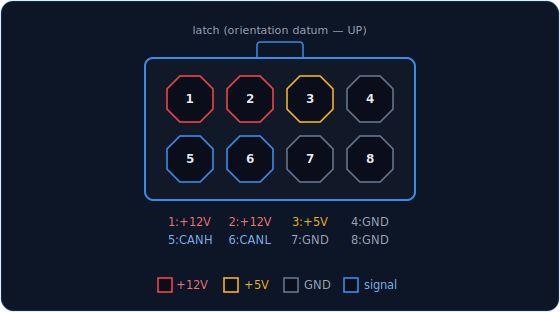
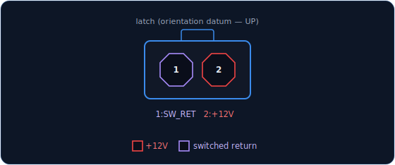
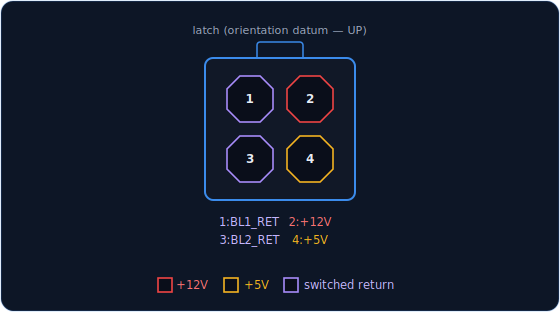
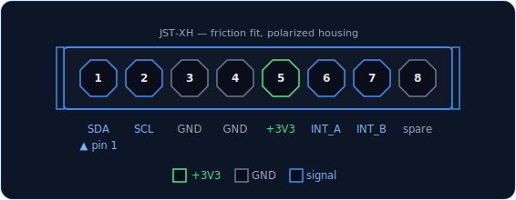
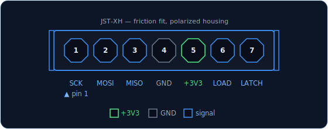

# Connector & Harness Guide

Two connector families cover the whole cockpit: **Molex Mini-Fit Jr** for power-class
harnesses (main bus, backlight), **JST-XH** for signal-class legs (I²C, SPI, switches).
Nothing smaller than **2.54 mm pitch** is used anywhere, and no third family is ever
introduced — every harness in the aircraft crimps with two tools
(Mini-Fit Jr: JRready ST6490-ACT · JST-XH: Engineer PA-09).

**Wire gauge:** 16–18 AWG silicone on the main bus (power + CAN daisy-chain);
24 AWG on signal harnesses and backlight legs.

## The interface-class standard

Harnesses standardize at the **connector, not the silicon**: a sub-panel that presents a
clean I²C leg is a standard device whatever chips live inside it, and the same goes for an
SPI leg. Each interface class has a unique pin count within its connector family, so a
cable physically cannot mate with the wrong socket.

| Class | Pins | Family | Reaches |
|---|---|---|---|
| CAN trunk + power (`J_BUS_IN`/`J_BUS_OUT`) | 8 (2×4) | Mini-Fit Jr | host boards only, daisy-chained |
| Backlight single-zone (`J_BL`) | 2 (1×2) | Mini-Fit Jr | one dimming zone per cable |
| Backlight dual-zone + utility 5 V | 4 (2×2) | Mini-Fit Jr | gauge panels (two zones) |
| I²C leg (`J_I2C`) | 8 | JST-XH | I²C-class sub-panels |
| SPI leg (`J_SR`) | 7 | JST-XH | SPI-class sub-panels (chain end) |

**Which signal leg does a sub-panel get?** Physics decides: panels with **rotary encoders
or fast gauges** take the SPI leg (shift-register I/O keeps encoder counting off the I²C
bus — see [Hardware Standards](standards.md)); everything else is legitimate on the I²C
leg, whatever it uses internally (MCP23017, OLED, ADS1115).

**Layers:** the CAN trunk terminates only at **host** boards (the MCU carrier of each
controller). A sub-panel's complete interface is one signal leg plus a backlight cable.
Hosts may carry several parallel connectors of one class (two `J_BL` sockets on one zone,
two `J_I2C` on one bus) — sized per controller during schematic design. The exception is
the SPI leg: shift-register chains are series devices, so each host chain supports **one**
end-node leg (chain-through connectors are a future class, specified when a gauge-cluster
controller needs them).

!!! warning "Wires are not color-coded"
    **Pin position is the only identification.** The diagrams below are the build-time
    reference — crimp with the drawing open. All views look **into the cable-housing
    mating face**; the board header is the mirror image.

## CAN trunk — `J_BUS_IN` / `J_BUS_OUT`

Molex Mini-Fit Jr 2×4 (`5566-08A2` header / 5557 cable housing), two per host board,
bus passes straight through.

*Pass-through pair on every host: `J_BUS_IN` ↔ `J_BUS_OUT`. 18 AWG, ≈8 A/pin all-loaded;
carries the per-console power feed. CANH/CANL share a row for clean differential routing.
View: into the cable-housing mating face, latch up; numbering per the Molex 5557 drawing —
verify before first crimp.*

## Backlight single-zone — `J_BL`

Molex Mini-Fit Jr 1×2 (`5566-02A2`), one per lighting zone, never mixed into a signal
harness.

*Low-side dimming: +12 V → LED string → `SW_RETURN` → zone MOSFET on the host. The return
is a **switched line, not a ground**. View: into the cable-housing mating face, latch up.*

## Backlight dual-zone + utility 5 V — gauge panels

Molex Mini-Fit Jr 2×2. Gauge-bearing panels carry **two dimming zones** — legend/panel
markings and in-gauge instrument lighting — mirroring the aircraft's separate console and
instrument dimmer circuits. Low-side switching makes each return supply-agnostic: a zone's
string may hang on 12 V (legend strips) or 5 V (in-gauge LEDs).

*BL1 = legend zone, BL2 = gauge zone; both returns are switched lines to the host MOSFETs.
The +5 V is a **utility feed for small loads only** (≲50 mA — driver logic, in-gauge LEDs);
its return rides the panel's signal-cable GND. **Servos never use it** — servo panels buck
locally from 12 V. View: into the cable-housing mating face, latch up; pin order is the
proposed standard — verify against the Molex 5557 drawing before first crimp.*

## I²C leg — `J_I2C1` / `J_I2C2`

JST-XH 8-pin. The I²C-class sub-panel interface: MCP23017 I/O, OLED displays (behind a
panel-local mux when several share an address), ADS1115 analog — internals are the panel's
business.

*SDA/SCL run through 33 Ω series resistors at the host; INT pins serve MCP interrupts and
are spares on MCP-less panels. **This leg carries no +5 V** — a panel that needs it takes
the dual-zone backlight cable's utility line. View: into the cable-housing mating face,
pin 1 marked.*

## SPI leg — `J_SR`

JST-XH 7-pin. The SPI-class sub-panel interface: 74HC165/74HC595 shift-register chains
for encoder-bearing and fast-gauge panels. One per host chain, at the chain's end.

*`LOAD` = '165 SH/LD̄ capture strobe, `LATCH` = '595 STCP publish strobe; 33 Ω series on
SCK/LOAD/LATCH at the host. The bus is dedicated — MISO is never shared with another SPI
device. View: into the cable-housing mating face, pin 1 marked; pin order is the proposed
standard — verify against the JST-XH drawing before first crimp.*

## Switch & control wiring

Switch harnesses use JST-XH sized to the pin count (4/6/8), one shared GND per connector
group. Deep pin tables, net names, and the electrical rationale live in the discipline
reference (`docs/_source/hardware-standards.md` — Connectors and Shift-Register I/O
sections).
